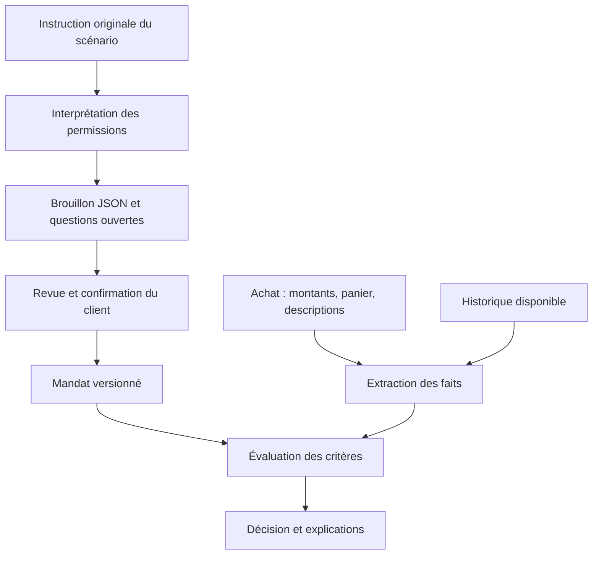

# Périmètre actuel : socle technique et place de l'IA

Ce cadrage remplace la demande précédente d'implémenter immédiatement tout le moteur métier. L'équipe veut d'abord un socle offline solide, puis définir ensemble l'interprétation des permissions et l'évaluation des achats. Aucun modèle d'IA n'est choisi et aucun LLM n'est actuellement implémenté.

## 1. Deux usages possibles de l'IA, un traitement distinct



Un LLM pourra intervenir dans **l'interprétation des permissions** : transformer le texte du client en proposition structurée. Un autre appel, éventuellement au même modèle, pourra servir à **l'extraction des faits** : comprendre les descriptions des articles, leur taille, leur couleur ou leurs conditions. Ces deux opérations restent séparées, même avec un seul fournisseur.

Le traitement des achats compare ensuite les permissions confirmées aux faits disponibles. Le montant total est déjà structuré dans les données ; son chargement ne nécessite pas de LLM. Les critères, seuils, arbitrages et la place éventuelle d'une analyse sémantique dans la décision restent à concevoir avec l'équipe.

Le texte client décrit une intention ; le texte marchand décrit un produit et reste non fiable. Les descriptions ne peuvent jamais modifier le mandat.

## 2. Comment démarrer sans choisir un modèle

1. Lire et conserver exactement `scenario_catalogue.cardholder_instruction`.
2. Créer un brouillon avec cette instruction, sans prétendre en avoir extrait toutes les règles.
3. Permettre une saisie manuelle ou un chargement de données de démonstration clairement identifiées pour tester le formulaire et le stockage.
4. Conserver les exigences non interprétées comme questions/exigences en attente. Ne pas inventer de taille, couleur, produit choisi ou critère de marchand.
5. Réserver une interface `PolicyInterpreter` : son implémentation future pourra être un formulaire, un modèle local ou un autre adaptateur.

Les cinq scénarios ne deviennent donc pas cinq politiques métier codées en dur. Le socle expose leurs textes et leurs achats ; il n'est pas chargé maintenant de décider comment interpréter intégralement chaque instruction.

## 3. Le mandat a une structure même sans IA

Conserver les champs officiels `instruction`, `hard_rules`, `uncertainty_policy`, `guidance` et `open_questions`. Ajouter **dans notre stockage local seulement** une provenance et un état d'interprétation, ainsi qu'une liste d'exigences restant à traiter. Un champ supplémentaire n'est jamais ajouté au snapshot officiel Viseca.

Exemple de brouillon initial, sans extraction effectuée :

```json
{
  "instruction": "Replace my worn road-running shoes in size 43. Buy only from a specialist sports retailer, only if the order can be returned within 14 days or more, and pay no more than CHF 200. Ask me when uncertain.",
  "hard_rules": [],
  "uncertainty_policy": "ask",
  "guidance": ["Interprétation métier non configurée ; aucune règle extraite automatiquement."],
  "open_questions": ["Définir et valider la transcription des exigences de cette instruction."],
  "interpretation": {
    "status": "not_started",
    "producer": null,
    "version": null,
    "model_id": null,
    "requirements": []
  }
}
```

`ask` est ici le défaut explicite du formulaire, à revoir par le client ; ce JSON n'est pas la sortie d'un modèle. Un tableau de règles vide avec `not_started` signifie « pas interprété », jamais « tous les achats sont permis ».

Les propositions futures devront conserver le texte source, les règles proposées, les points non résolus et la provenance de leur production. La validation JSON vérifie leur forme ; la revue du client vérifie leur sens. Un résultat de LLM n'active pas directement un mandat.

## 4. Ce qu'il faut coder maintenant

- Contrats, relations et validation des CSV/JSON existants.
- Stockage local des brouillons, mandats, snapshots, runs et traces.
- Routes et trois écrans pour consulter les scénarios, préparer les permissions et inspecter les achats.
- Conservation du panier complet, de `purchase_description`, de `item_name`, de `item_details` et des descriptions catalogue avec leurs sources distinctes.
- Interfaces d'interprétation, d'analyse des achats et d'évaluation, remplaçables sans réécrire les routes ou les données.
- Tests techniques de ces interfaces et de l'état, avec des résultats simulés portant cette provenance.

Les interfaces non branchées retournent explicitement `not_evaluated` / « Analyse non configurée ». Ce statut est **interne**, pas une quatrième décision Viseca. Le site ne fabrique ni approbation ni refus métier pour masquer une fonction absente.

Le parcours initial fonctionne en mode `inspection` : il peut préparer un mandat pour revue et rejouer les données, mais ne prend pas de décisions de paiement. Les champs canoniques restent validables ; une conformité au schéma ne signifie pas que l'instruction a été comprise. Les délais de décision et les résolutions de paiement ne s'activent que dans le futur mode `evaluation`, avec une politique interprétée et un évaluateur configuré. Les tests de transitions utilisent un adaptateur de test séparé.

## 5. Ce qui sera conçu avec l'équipe ensuite

Le choix du modèle et de son hébergement, la transcription texte → permissions, les comparaisons prix/taille/couleur, le traitement des descriptions et des contradictions, la familiarité et la fréquence des marchands, les signaux de session, les doublons et la combinaison des incertitudes. Aucun seuil proposé précédemment n'est une décision produit acquise.

L'application reste offline. Si un LLM devient nécessaire tout en gardant cette contrainte stricte, il devra pouvoir s'exécuter localement ; choisir un service distant modifierait explicitement ce périmètre. Aucun fournisseur, modèle, runtime d'inférence ou téléchargement n'est imposé au socle.

L'extensibilité repose sur quelques interfaces et résultats versionnés, pas sur des microservices. Ajouter ultérieurement un analyseur de couleur ne doit pas nécessiter une nouvelle route, un changement du format d'achat ou une réécriture du stockage des mandats.

## 6. Consigne pour l'agent qui codera

Lire ce document en premier, puis suivre le [plan d'action révisé](04_PLAN_ACTION.md). Le prompt précédent demandant les huit étapes du moteur complet est remplacé : implémenter uniquement la phase A du nouveau plan. La phase B attend le travail métier avec l'équipe. Démontrer le fonctionnement du socle sans présenter les analyses simulées comme de l'intelligence métier existante.
