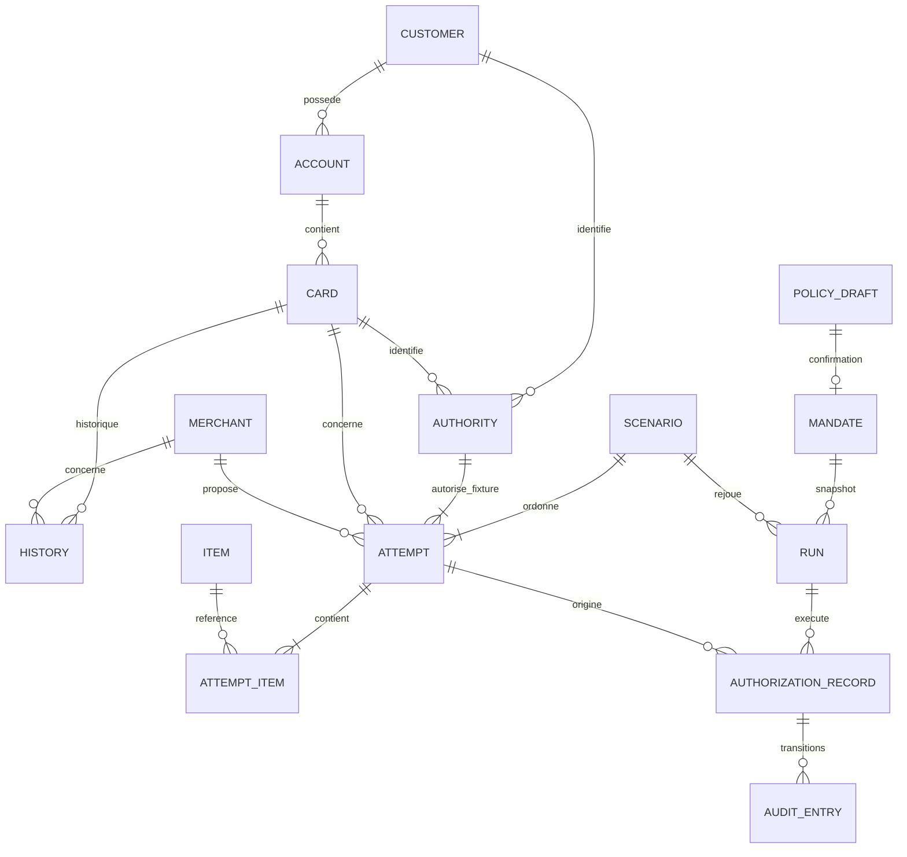

# Structure de données

Statut : conception du socle offline, conformément au [cadrage actuel](00_SOCLE_ET_PLACE_IA.md). Les contrats fournis restent inchangés. Les types applicatifs sont nouveaux ; les critères métier et le choix du modèle restent à définir avec l’équipe. Les contrats de décision préparent une étape ultérieure, pas une obligation de construire maintenant le moteur complet.

## 1. Quatre couches de données

| Couche | Contenu | Propriétaire |
| --- | --- | --- |
| Référentiels et fixtures | CSV, schémas et manifeste existants | Pack, en lecture seule |
| Permissions | Brouillon, confirmation, mandat, versions | Client via l'application locale |
| Exécution | Run, événement canonique, faits calculés, décisions, réponses humaines | Runtime local et moteur |
| Présentation et audit | Vues du site, journaux, résumé du run | Projections des données précédentes |



Une autorité de fixture n'est pas un mandat. Une tentative source n'est pas son exécution. Un même scénario peut être rejoué plusieurs fois avec des décisions différentes.

## 2. Types communs et référentiels

```ts
type Currency = "CHF" | "EUR" | "GBP" | "USD";
type ISODate = string;       // YYYY-MM-DD, validé à l'entrée
type ISODateTime = string;   // ISO 8601 UTC, validé à l'entrée
type DecimalString = string; // montant sérialisé, ex. "245.28"
type Term = "true" | "false" | "unknown" | "not_applicable";
type Decision = "approve" | "decline" | "step_up";
type UncertaintyPolicy = "ask" | "decline" | "approve";
```

Les identifiants restent des chaînes opaques. Des alias TypeScript distincts (`CardId`, `RunId`, `SourceAuthorizationId`, etc.) évitent de les échanger. Aucun identifiant n'est obtenu en incrémentant un ID du catalogue.

Les en-têtes exacts sont définis dans [data_pack.schema.json](../data/schemas/data_pack.schema.json). Les types de l'historique sont dans [authorization_history.schema.json](../data/schemas/authorization_history.schema.json). Ses extensions `x-csv-column-contract` et celles du pack doivent être interprétées par le loader : valider simplement le JSON du manifeste ne valide pas les CSV.

| Entité / clé | Champs à conserver et types normalisés | Relation / usage |
| --- | --- | --- |
| `Customer` / `customer_id` | `persona_name`, `home_region`, `background`, `shopping_preferences`, `typical_spending`, `budget_style`, `travel_pattern` : chaînes | Contexte descriptif, aucune règle implicite |
| `Account` / `account_id` | `customer_id`, `account_type`, `account_purpose`, `base_currency`, `status`, `opened_on`, `per_transaction_limit_chf`, `monthly_limit_chf` | FK client ; dates validées, limites décimales ; pas de solde disponible |
| `Card` / `card_id` | `account_id`, `card_type`, `card_purpose`, `status`, `first_used_on`, `expires_on`, `online_enabled`, `international_enabled`, `virtual_card` | FK compte ; dates validées, trois vrais booléens internes ; statut actuel `active/blocked/expired` |
| `Merchant` / `merchant_id` | `merchant_name`, `merchant_category`, `merchant_mcc`, `merchant_country`, `merchant_city`, `availability`, `recurring_capable` | MCC chaîne de 4 chiffres ; `recurring_capable` reste `"true"/"false"` dans le contrat événement |
| `Item` / `item_id` | `item_name`, `item_category`, `item_description`, trois `unit_price_*_chf` | Fourchettes décimales en CHF, indicatives |
| `FxRate` / `from_currency` | `to_currency`, `rate`, `rate_date`, `source` | Taux Decimal conservant ses 6 décimales ; cible CHF |
| `Scenario` / `scenario_id` | `scenario_name`, `cardholder_instruction`, `control_question`, `control_theme`, `event_count`, `short_rationale` | `event_count` entier ; instruction exacte conservée |
| `FixtureAuthority` / `authority_id` | `customer_id`, `card_id`, `valid_from`, `valid_until`, `initial_status` | Client et carte, timestamps simulés ; aucun `scenario_id` dans ce fichier |
| `SourceAttempt` / `authorization_id` source `AU…` | Toutes les 25 colonnes du CSV ; prix décimaux, compteurs entiers, champs nullable normalisés | FK scénario, autorité, carte, marchand ; auto-référence `related_authorization_id` |
| `SourceAttemptItem` / `(authorization_id, line_no)` | `item_id`, `item_name`, `item_category`, `quantity`, `unit_price`, `currency`, `item_details` | FK tentative et produit ; numéro de ligne et quantité entiers ≥ 1 |
| `HistoricalAuthorization` / `authorization_id` historique `TR…` | Les 40 colonnes documentées, y compris type, initiateur, résultat, appareil, compteurs et `related_transaction_id` nullable | FK client/compte/carte/marchand ; remboursement vers un `TR…` |

Toutes les lignes sont chargées une fois. Index minimaux : `customersById`, `accountsById`, `cardsById`, `merchantsById`, `itemsById`, `authoritiesById`, `scenariosById`, `fxByCurrency`, `attemptsByScenario`, `itemsByAttempt`, `historyByCard`. Les tentatives sont triées par `replay_order`, l'historique par `(timestamp, authorization_id)` et les paniers par `line_no`.

Valider les clés et les relations, mais aussi `authority.customer_id = account.customer_id` et `authority.card_id = attempt.card_id`. Une jointure manquante arrête le chargement avec le fichier, la ligne et le champ concernés.

## 3. Permissions : du brouillon au snapshot

```ts
type HardRule = {
  field: string;
  operator: "<" | "<=" | "=" | "!=" | ">" | ">=" | "in" | "not_in";
  value: number | string | string[];
  currency?: Currency | null;
  scope?: "purchase" | "period" | null;
  period_days?: number | null;
};

type PolicyContent = {
  instruction: string;
  hard_rules: HardRule[];
  uncertainty_policy: UncertaintyPolicy;
  guidance: string[];
  open_questions: string[];
};

type Interpretation = {
  status: "not_started" | "partial" | "reviewed";
  producer: "manual" | "fixture" | "model" | null;
  version: string | null;
  model_id: string | null;
  requirements: Array<{
    requirement_id: string;
    source_excerpt: string;
    description: string | null;
    status: "pending" | "mapped";
    rule_indexes: number[]; // indices des règles proposées ; vide si non interprété
  }>;
};

type PolicyDraft = PolicyContent & {
  interpretation: Interpretation;
  draft_id: string;
  source_scenario_id: string; // provenance locale ; pas une règle
  created_at: ISODateTime;
  compiler_version: string | null; // null tant que non configuré
  validation_errors: Array<{ field: string; message: string }>;
};

type MandateRecord = PolicyContent & {
  interpretation: Interpretation;
  mandate_id: string;
  draft_id: string;
  source_scenario_id: string;
  version: number;
  status: "active" | "revoked";
  confirmed_at: ISODateTime;
  confirmation_origin: "local_user" | "test_script";
  updated_at: ISODateTime;
  revoked_at: ISODateTime | null;
  compiler_version: string | null; // null tant que non configuré
};
```

`HardRule` reproduit le format officiel. Sa valeur ne peut pas être un booléen, un objet, `null` ou une liste de nombres. Aucun champ supplémentaire n'est ajouté à cette règle.

Au départ, conserver le texte original dans un brouillon avec `interpretation.status="not_started"`. Aucun modèle n'extrait automatiquement les cinq politiques. Une saisie manuelle ou une fixture explicitement marquée permet de tester le stockage et l'interface. Le futur interpréteur proposera des règles et des exigences en attente, puis la revue humaine vérifiera leur sens. La validation JSON ne prouve pas que toutes les restrictions du texte sont couvertes.

`hard_rules: []` ne signifie jamais « tout autoriser » lorsque l'interprétation n'est pas terminée. Confirmer le texte pour le parcours d'inspection n'autorise aucune décision automatique. Le mode d'évaluation futur exige une interprétation revue, une couverture des exigences vérifiée et un évaluateur configuré. Aucune exigence non interprétée n'est silencieusement perdue.
La création conserve `cardholder_instruction` à l'identique. Les préférences des personas, les thèmes et les descriptions de scénarios ne sont pas ajoutés silencieusement à la politique. La confirmation crée un mandat actif. Son identité client/carte/profil est liée **au démarrage du run**, via l'autorité du scénario ; elle ne vient pas du formulaire de permissions.

Le snapshot transmis dans l'événement est **uniquement** le `mandate` du schéma officiel : `mandate_id`, `status`, `customer_id`, `card_id`, `instruction`, `hard_rules`, `uncertainty_policy`, `profile_id`. `guidance`, `open_questions`, `version`, `compiler_version` et `interpretation` restent dans le stockage applicatif. Un run conserve sa copie et son numéro de version.

Modification active : préserver toutes les anciennes règles et ajouter seulement des restrictions combinées par ET. Conserver le choix d'incertitude ou passer de `approve/ask` à `decline`. Une règle existante à 200 CHF reste présente si l'on ajoute une limite à 180 CHF. Modifier librement ou assouplir nécessite un nouveau brouillon confirmé. Cela respecte les restrictions de PATCH documentées, sans devoir démontrer l'équivalence de deux politiques arbitraires.

## 4. Événement canonique et adaptation CSV

`AuthorizationEvent` est dérivé de [authorization_event.schema.json](../data/schemas/authorization_event.schema.json), sans second format offline. C'est l'objet `data` d'une future enveloppe Viseca, pas l'enveloppe entière.

| Bloc | Contenu et contraintes importantes |
| --- | --- |
| Racine | `type: "authorization.request"`, `request_id`, `deadline_at`, `authorization`, `mandate`, `context`, `runtime` |
| `authorization` : identité | ID du run pour l'achat, `source_authorization_id`, `scenario_id`, `replay_order`, `mandate_id`, `profile_id`, `card_id`, `initiator_type: "agent"` |
| `authorization` : faits | Marchand imbriqué, timestamp simulé, prix et devise, sous-total, livraison, canal, appareil, statuts autorité/carte, période source, vélocité, fulfillment, date de livraison, retours/annulation, lien d'achat, description et panier |
| `merchant` | Les huit champs du catalogue marchand ; aucune identité basée sur son nom |
| `items[]` | Les huit champs de la ligne panier, sans son `authorization_id` source ; tableau non vide |
| `mandate` | Snapshot lié au run décrit ci-dessus |
| `context` | `approved_spend_in_period_chf: number \| null`, `recent_authorizations[]` avec ID, timestamp, marchand, montant CHF et statut |
| `runtime` | `received_at`, `history_window_minutes`, `context_basis: "run_decisions_and_scenario_timestamps"` |

Règles de construction :

1. Sélectionner les tentatives du scénario et toutes leurs lignes, puis joindre autorité → carte → compte → client et marchand.
2. Vérifier les identités ; employer les statuts au moment de la tentative et les dates simulées. Ne pas réécrire l'historique avec le statut actuel des cartes.
3. Supprimer les champs source non admis : `authority_id` et `merchant_id` à plat n'existent pas dans `authorization` canonique ; le marchand est imbriqué.
4. Convertir montants en nombres JSON et compteurs en entiers. Garder les enums textuels, dont `order_returnable` et `recurring_capable`.
5. Conserver les champs nullable avec `null` : date de livraison, période source, achat lié et son statut. Les 45 valeurs de `spend_in_period_before_chf` restent `null`, jamais remplacées par zéro.
6. Ajouter les IDs locaux, le mandat lié et le contexte calculé **avant** la tentative courante.
7. Remapper les références `AU…` vers les IDs locaux du même run. Conserver le statut lié fourni comme fait source ; consulter le registre local pour le résultat effectif si cet achat y existe. En cas de divergence, tracer les deux, sans réécrire l'événement déjà reçu.
8. À l'émission, fixer `received_at` et un nouveau `deadline_at` réel ; valider strictement avec Ajv 2020 et le support des formats date/date-time. Les champs inconnus sont refusés, pas effacés silencieusement.

Les prix JSON sont des nombres car le schéma l'exige. Les calculs utilisent `Decimal`, créé depuis les chaînes CSV ou la représentation décimale des nombres reçus. Arrondir à deux décimales en half-even ; sérialiser les totaux applicatifs en `DecimalString`.

```text
sous-total = somme(quantity × unit_price)
total = sous-total + livraison             // dans la monnaie de la commande
total CHF = arrondi_half_even(total × taux, 2)
```

Tous les paniers du pack utilisent la monnaie de leur commande. Un panier mixte futur est rejeté par le validateur de notre adaptateur tant que sa méthode de conversion n'est pas définie. Ni le pays marchand ni la fourchette de prix catalogue ne changent ces calculs.

## 5. Interfaces pour l'interprétation et le traitement futur

L'IA éventuelle est derrière des interfaces injectées par l'application. Aucun choix de fournisseur, aucun seuil de risque ni dictionnaire exhaustif de critères n'est fixé maintenant.

```ts
type Observation = {
  key: string; // nom enregistré par l'analyseur, ex. item.color
  subject: "purchase" | "item" | "merchant" | "session";
  line_no: number | null;
  state: "observed" | "missing" | "ambiguous";
  value: string | number | boolean | null;
  unit: string | null;
  source_fields: string[]; // chemins vers les champs d'origine
  producer: { id: string; version: string; kind: "code" | "model" | "manual" | "fixture" };
};

type EvaluationFacts = {
  schema_version: 1;
  status: "not_configured" | "partial" | "complete";
  observations: Observation[];
  issues: Array<{ code: string; message: string; source_fields: string[] }>;
};

type EvaluationResult =
  | { status: "not_evaluated"; reason: string }
  | { status: "evaluated"; result: DecisionResult };

interface PolicyInterpreter {
  interpret(input: { instruction: string }): Promise<{
    hard_rules: HardRule[];
    uncertainty_policy: UncertaintyPolicy | null; // proposition, à confirmer
    guidance: string[];
    open_questions: string[];
    interpretation: Interpretation;
  }>;
}

interface PurchaseAnalyzer {
  analyze(input: {
    event: AuthorizationEvent;
    history: ReadonlyArray<HistoricalAuthorization>;
    prior_authorizations: ReadonlyArray<AuthorizationRecord>;
  }): Promise<EvaluationFacts>;
}

interface DecisionEvaluator {
  evaluate(input: {
    event: AuthorizationEvent;
    interpretation: Interpretation;
    facts: EvaluationFacts;
  }): EvaluationResult;
}
```

Les types d'événement et d'historique viennent des schémas fournis ; les autres objets sont décrits ici. Ces interfaces sont un point de branchement minimal. Les entrées sont des snapshots en lecture seule, jamais des services permettant de modifier le mandat ou les décisions. Les versions futures pourront ajouter des analyseurs sans changer les routes.

Le service de permissions appelle l'interpréteur, valide sa sortie et la présente comme brouillon. Le runtime prépare les données, appelle les analyseurs, puis l'évaluateur. Les appels éventuels à un LLM restent dans les adaptateurs d'interprétation/analyse ; la validation et la gestion d'état ne dépendent pas de sa présence.

`Observation.key` n'autorise pas un JSON incontrôlé : chaque analyseur déclare les clés qu'il produit et leur type, et ses sorties sont validées. Les montants normalisés utilisent des chaînes décimales accompagnées de leur devise. Ajouter la couleur, par exemple, ajoutera une observation avec une source et un analyseur identifié ; aucune colonne n'est inventée dans les CSV. Les états `missing/ambiguous` conservent `value=null`. Les versions et la couverture des exigences doivent être vérifiées avant de traiter une analyse comme suffisante pour décider.

Conserver `purchase_description`, `items[].item_name`, `items[].item_details` et, séparément, `items.csv.item_description`. Les conditions propres à une tentative ne sont pas remplacées par le texte générique du catalogue. Une taille, couleur ou caractéristique absente reste absente. Les textes marchands ne peuvent jamais écrire une permission.

L'implémentation initiale de l'interpréteur renvoie une interprétation non commencée ; l'analyseur retourne `not_configured` ; l'évaluateur retourne `not_evaluated`. Des doubles de test permettent de vérifier les appels et les transitions, avec une provenance explicite. Un branchement vide ne retourne ni `approve`, ni `decline`, ni `step_up` automatiquement.

Les comparaisons de prix, taille, couleur, retours, description et contexte marchand seront conçues ensuite avec l'équipe. Aucun seuil de familiarité, règle de doublon, stratégie d'extraction ou modèle n'est imposé par ce socle.

## 6. Run et identifiants

```ts
type RunStatus = "ready" | "running" | "waiting_human" | "completed"
  | "cancelled" | "failed" | "interrupted";

type RunRecord = {
  run_id: string;
  scenario_id: string;
  mode: "inspection" | "evaluation";
  mandate_id: string;
  mandate_version: number;
  mandate_snapshot: AuthorizationEvent["mandate"];
  fixture_authority_id: string;
  customer_id: string;
  card_id: string;
  profile_id: string;
  status: RunStatus;
  next_replay_order: number;
  total_attempts: number;
  emitted_count: number;
  started_at: ISODateTime;
  finished_at: ISODateTime | null;
  config: {
    decision_timeout_ms: number; // défaut local : 8 000
    human_timeout_ms: number;    // défaut local : 120 000
    history_window_minutes: number; // contexte récent : 10
  };
  pack_version: string;
  engine_version: string | null;
  facts_version: string | null;
};
```

Créer un `runKey` neuf à chaque exécution et enregistrer la correspondance avant l'émission :

```text
run_id           = LOCAL_RUN_{runKey}
request_id       = LOCAL_REQ_{runKey}_{source_authorization_id}
authorization_id = LOCAL_AUTH_{runKey}_{source_authorization_id}
profile_id       = LOCAL_PROFILE_{runKey}
mandate_id       = LOCAL_TM_{mandateKey}
```

Les clés sont générées localement ; elles peuvent être injectées en tests pour rendre les snapshots reproductibles. Relivrer le même achat d'un run réutilise les mêmes IDs ; rejouer le scénario crée de nouveaux IDs. Un `request_id` basé seulement sur scénario/position serait insuffisant. `TR…`, `AU…`, `AUTH…`, `TM…` et les IDs locaux ne sont jamais interchangeables.

Le socle utilise `mode="inspection"` : chaque achat est conservé avec `phase="awaiting_analysis"`, `status="pending"` et `engine_decision=null`. Aucun délai de paiement n'est activé ; le `deadline_at` canonique reste une donnée de simulation sans effet dans ce mode. Après la dernière tentative, `completed` signifie « inspection terminée », pas « achats décidés ». Les résolutions humaines de paiement sont désactivées. Le mode `evaluation` reste réservé à un évaluateur configuré et une interprétation revue ; son cycle futur est décrit ci-dessous.

Un seul run non terminal à la fois dans la V1. Plusieurs achats peuvent néanmoins attendre une réponse humaine. `ready` attend le prochain clic ; `running` traite un achat ; après épuisement des tentatives, `waiting_human` attend les dernières réponses, puis `completed`. Une réponse en attente n'empêche pas l'émission suivante. `cancelled/failed/interrupted` ne signifie pas que les achats déjà approuvés sont annulés.

## 7. Registre, budgets et doublons

```ts
type AuthorizationStatus = "pending" | "approved" | "declined" | "cancelled";
type CompletionReason = "engine" | "human" | "automatic_timeout"
  | "human_timeout" | "run_cancelled" | "mandate_revoked";

type AuthorizationRecord = {
  run_id: string;
  authorization_id: string;
  source_authorization_id: string;
  event: AuthorizationEvent;
  facts: EvaluationFacts | null;
  phase: "queued" | "awaiting_analysis" | "awaiting_human" | "final";
  status: AuthorizationStatus;
  engine_decision: DecisionResult | null;
  human_resolution: HumanResolution | null;
  completion_reason: CompletionReason | null;
  human_deadline_at: ISODateTime | null;
  finalized_at: ISODateTime | null;
  revision: number;
};

type LocalRunState = {
  run: RunRecord;
  recordsById: Map<string, AuthorizationRecord>;
  sourceToRuntimeId: Map<string, string>;
};
```

Le registre conserve les faits complets de tous les achats émis, y compris les paniers. Aucun montant cumulé mutable n'est la seule vérité du budget.

Le stockage distingue dès maintenant `pending`, `approved`, `declined` et `cancelled`, et garde les timestamps simulés. Cela permettra d'ajouter les fenêtres de budget et les analyses de répétition sans changer les données enregistrées. Les bornes des fenêtres, le périmètre exact d'un budget et le traitement métier d'une réponse tardive seront arrêtés avec l'équipe.

Deux mécanismes sont distincts : la relivraison du même ID doit être idempotente dès le socle ; deux achats différents qui se ressemblent demandent une analyse métier ultérieure. Aucun seuil temporel de doublon n'est fixé maintenant. Une référence à un achat antérieur est conservée avec son résultat observé, sans en déduire une décision.

Les sommes techniques n'additionnent que les décisions finales approuvées ; un `step_up` n'est pas une dépense. En inspection, aucune décision n'est produite et aucun achat n'augmente la dépense. Le compteur de période reste `null` tant que la convention de période n'est pas configurée. La vélocité fournie par le pack garde sa définition officielle, sans devenir un seuil de risque implicite.

## 8. Décision, réponse humaine et audit

```ts
type Evidence = {
  code: string;
  field?: string;
  observed?: unknown;
  expected?: unknown;
};

type DecisionResult = {
  authorization_id: string;
  decision: Decision;
  reason_codes: string[];
  customer_message: string;
  evidence: Evidence[];
  engine_version: string;
};

type HumanResolution = {
  resolution_id: string;
  authorization_id: string;
  decision: "approve" | "decline";
  customer_message: string;
  evidence: Evidence[];
  resolved_at: ISODateTime;
  origin: "local_user" | "test_script";
};

type AuditEntry = {
  schema_version: 1;
  sequence: number;
  recorded_at: ISODateTime;
  run_id: string;
  authorization_id: string;
  kind: "engine_decision" | "human_resolution" | "timeout" | "cancellation";
  previous_status: AuthorizationStatus;
  record_after: AuthorizationRecord;
};
```

`unknown` dans les preuves signifie une valeur JSON sérialisable et bornée ; pas d'objet exécutable. Les preuves doivent permettre de retrouver la ligne, le champ ou les achats contributeurs. Codes stables possibles : `purchase_limit_exceeded`, `period_limit_exceeded`, `item_mismatch`, `missing_return_terms`, `unfamiliar_device`, `possible_duplicate`, `merchant_instruction_detected`, `policy_satisfied`.

Cette section réserve les contrats des décisions futures. Leur combinaison métier sera définie avec l’équipe. Le socle valide techniquement les événements et conserve les traces ; il n’émet aucune décision de paiement lorsqu’une analyse n’est pas configurée. Les transitions ci-dessous concernent le futur mode `evaluation` et ses tests, jamais une approbation implicite en mode `inspection`.

| Départ | Événement | Arrivée et effet |
| --- | --- | --- |
| `queued/pending` | Moteur `approve` | `final/approved`, dépense comptée une fois |
| `queued/pending` | Moteur `decline` | `final/declined`, aucune dépense |
| `queued/pending` | Moteur `step_up` | `awaiting_human/pending`, deadline humaine locale créée |
| `awaiting_human/pending` | Client approuve, contrôles de commit satisfaits | `final/approved`, ajout au budget à la date simulée d'achat |
| `awaiting_human/pending` | Client refuse | `final/declined` |
| `pending` | Deadline dépassée | `final/declined`, raison de timeout distincte de la décision du moteur |
| `pending` | Annulation du run ou révocation locale | `final/cancelled`, raison explicite |
| `final` | Même commande rejouée | Retour du résultat existant, aucun nouvel effet |
| `final` | Réponse contradictoire | Conflit, résultat final conservé |

Pas de deuxième décision automatisée après `step_up`. La résolution est un événement distinct. L'application fixe `origin` : le navigateur ne peut pas prétendre qu'un script constitue une confirmation humaine. Les tests scriptés portent cette mention dans le rapport.

En mode `evaluation`, les deadlines de 8 s et 120 s sont des valeurs locales configurables inspirées des valeurs par défaut documentées, pas des réglages interrogés sur Viseca. Les timeouts utilisent une horloge injectée ; un test ne dort pas réellement 120 secondes.

## 9. Écriture, concurrence et fichiers

```text
.local-state/                    # ignoré par Git
  policies.json                  # brouillons, mandats, versions, confirmations
output/{run_id}/                 # ignoré par Git
  run.json                       # identité, snapshot, configuration, versions
  events.jsonl                   # événements canoniques reçus, immuables
  decisions.jsonl                # AuditEntry : transitions effectivement acceptées
  summary.json                   # compteurs et état terminal, régénérables
```

`policies.json` est écrit par remplacement atomique d'un fichier temporaire. Une seule instance locale écrit dans ces répertoires ; CLI et serveur ne s'exécutent pas simultanément sur le même stockage. Une file de commandes sérialise émission, décision, résolution, timeout et révocation. Écrire la transition avant de publier son nouvel état en mémoire et de répondre au client. Si l'écriture échoue, aucune approbation réussie n'est annoncée.

Chaque achat finalisé a un seul résultat final. Les compteurs du résumé sont dérivés du registre, pas incrémentés indépendamment. Une relivraison ne crée pas une nouvelle ligne de dépense. Les commandes HTTP mutables sont dédupliquées par clé d'idempotence, méthode, chemin et empreinte du corps pendant la session serveur ; même clé et contenu différent → conflit.

Au redémarrage, les mandats sont rechargés et les runs terminés sont consultables depuis leurs artefacts. Un run sans état terminal devient `interrupted`, en lecture seule. Aucun achat en attente n'est approuvé ni réémis automatiquement. La reprise durable d'un run actif n'est pas une fonctionnalité V1 ; les clés de commande d'une ancienne session ne sont pas rejouées automatiquement par le navigateur.

Une révocation met à jour le mandat courant et annule localement les achats encore en attente du run concerné ; le snapshot d'origine et les approbations passées restent conservés. Cette sémantique est celle de notre simulateur local, pas une promesse sur les achats en attente de l'API Viseca.

Les `Map` sont des index mémoire, jamais sérialisés directement avec `JSON.stringify`. Les fichiers stockent des tableaux/objets explicites, les montants applicatifs sous forme de chaînes décimales et les événements canoniques avec leurs nombres JSON. `policies.json` porte un `schema_version`, un tableau `drafts` et un tableau `mandates` ; le chargement valide cette structure avant de reconstruire les index. Le cache de commandes idempotentes appartient à la session serveur et n'est pas une nouvelle source de dépenses.
