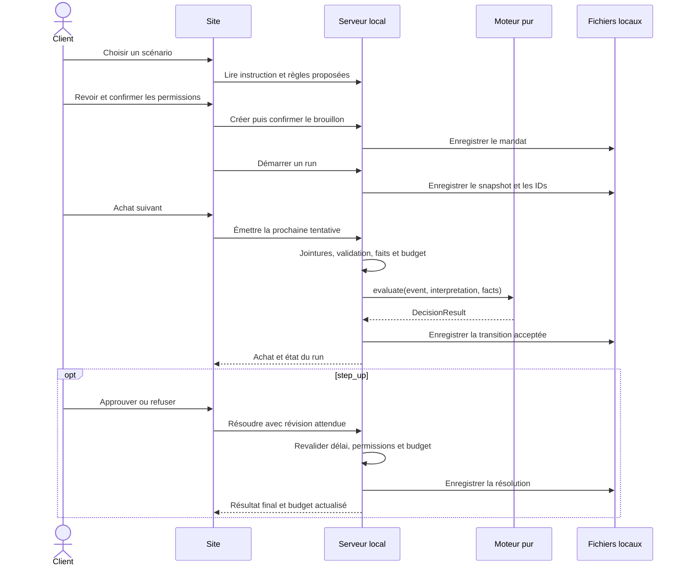

# Routes et parcours

Statut : routes proposées, aucune n’existe encore. Lire le [cadrage du socle](00_SOCLE_ET_PLACE_IA.md) : le premier parcours fonctionne en inspection, avec analyse métier non configurée. Les contrats de décision préparent la phase suivante. Les objets cités sont définis dans la [structure de données](02_STRUCTURE_DONNEES.md).

## 1. Un site local à trois écrans

HTML, CSS et TypeScript suffisent pour la V1. Le serveur Node.js/Fastify sert les fichiers compilés et les routes `/api/*` sur `127.0.0.1`. Tous les scripts, polices et images nécessaires sont locaux. Un seul serveur possède l'état ; le navigateur affiche cet état et envoie les choix de l'utilisateur.

| Route navigateur | Écran | Contenu et actions |
| --- | --- | --- |
| `/` | Scénarios | Cinq scénarios, nombre d'achats, sujet testé, accès au run courant et aux runs archivés |
| `/scenarios/:scenarioId` | Permissions | Instruction originale, état d’interprétation, saisie manuelle et questions ; enregistrer, confirmer pour inspection et révoquer ; futur interpréteur branchable |
| `/runs/:runId` | Exécution | Résumé, achats dans l’ordre, permissions conservées, bouton « Achat suivant », panier et descriptions ; analyses non configurées visibles ; décisions/réponses humaines préparées pour la phase B |

Sur la page scénario, `?draftId=…` ou `?mandateId=…` permet de retrouver la bonne version après actualisation. Sur la page run, `?authorizationId=…` ouvre le détail dans un panneau. Ces paramètres ne créent pas de nouveaux écrans.

Le serveur renvoie l'application pour ces routes HTML, y compris lors d'un accès direct. Une URL `/api/*` inconnue renvoie une erreur JSON, jamais la page HTML. Les identifiants sont validés avant toute lecture de fichier ; le navigateur ne transmet pas de chemin système.

### Présentation du run

Le mode `inspection` ne calcule pas de décision : afficher « Non évalué » pour les achats `awaiting_analysis`, sans bouton d’approbation, deadline de paiement ou alerte de risque inventée. Une inspection terminée n’est pas un run d’évaluation réussi. Les éléments budgétaires et décisions décrits ci-dessous sont réservés au mode `evaluation` futur.

Afficher séparément : le nombre d'achats émis, approuvés, refusés, en attente, annulés et non encore émis. Le budget glissant est étiqueté « 7 jours » quand il existe ; le total approuvé du run est un autre indicateur. Une ligne affiche montant d'origine et CHF si nécessaire.

Dans le détail : marchand, panier complet, conditions utiles, décision automatique, éventuelle réponse humaine, état final, raisons et preuves. Le client ne doit pas confondre « demande de confirmation » et « approuvé ». Une fin de lecture des CSV n'est pas une fin de run s'il reste des réponses humaines.

Le bouton « Achat suivant » émet seulement la prochaine tentative. Cela laisse le temps de comprendre le scénario sans construire un moteur d'animation. La CLI peut rejouer toute la séquence ; les deux utilisent les mêmes services. Après un `step_up`, l'utilisateur peut répondre ou continuer vers l'achat suivant.

Actualiser le run environ toutes les secondes tant qu'il est actif et après chaque mutation. Arrêter le polling à l'état terminal. Le délai humain est affiché à partir d'une deadline serveur ; la fermeture de l'onglet ne suspend pas les timeouts du serveur. Un échec de lecture conserve l'état affiché avec un message, sans inventer de nouvel état.

## 2. API locale

Préfixe réservé : `/api`. Les routes Viseca `/v1/*` ne sont ni implémentées ni appelées dans cette phase. Les objets renvoyés sont des contrats de **notre** application, pas une copie supposée de réponses distantes non documentées.

| Méthode | Route | Entrée | Réponse / effet |
| --- | --- | --- | --- |
| `GET` | `/api/health` | — | `200`, mode offline, versions et disponibilité du pack |
| `GET` | `/api/scenarios` | — | `200`, scénarios, nombres d'achats, résumé client/carte |
| `GET` | `/api/scenarios/:scenarioId` | — | `200`, instruction exacte, identité de fixture, brouillon non interprété et données à inspecter |
| `POST` | `/api/mandate-drafts` | `scenario_id` + `PolicyContent` | `201`, `PolicyDraft` validé pour affichage ; aucune permission active |
| `GET` | `/api/mandate-drafts/:draftId` | — | `200`, brouillon pour actualisation de l'écran |
| `POST` | `/api/mandate-drafts/:draftId/confirm` | `{ confirmed: true }` | `201`, `MandateRecord` actif ; un mandat par brouillon confirmé |
| `GET` | `/api/mandates/:mandateId` | — | `200`, mandat actuel, version, guidance et questions |
| `PATCH` | `/api/mandates/:mandateId` | `expected_version` + champs modifiables | `200`, version resserrée ; anciens runs inchangés |
| `DELETE` | `/api/mandates/:mandateId` | — | `200`, mandat révoqué + état du run éventuellement annulé ; répétition sans effet supplémentaire |
| `POST` | `/api/runs` | `{ scenario_id, mandate_id, mode: "inspection" }` | `201`, nouveau run `ready`, lié à un snapshot |
| `GET` | `/api/runs` | — | `200`, résumé des runs locaux, courant et archives |
| `GET` | `/api/runs/:runId` | — | `200`, `RunView` et liste ordonnée des achats déjà émis |
| `POST` | `/api/runs/:runId/next` | `{}` | `200`, achat émis pour inspection et nouvelle `RunView` ; évaluation seulement en phase B |
| `GET` | `/api/runs/:runId/authorizations/:authorizationId` | — | `200`, détail complet de l'`AuthorizationRecord` |
| `POST` | `/api/runs/:runId/authorizations/:authorizationId/resolve` | Choix humain, révision attendue et message facultatif | `409 analysis_not_configured` en inspection ; contrat `200` réservé à une résolution disponible en mode évaluation |
| `POST` | `/api/runs/:runId/cancel` | `{}` | `200`, fin du run, achats en attente annulés localement |

La route `/next` appelle le service de run côté serveur ; en inspection, elle conserve un résultat interne `not_evaluated`. Dans le futur mode d’évaluation, elle appellera le moteur configuré ; elle n'accepte ni prix, ni panier, ni décision du navigateur. Il n'y a pas de route publique permettant au site de soumettre une décision automatique. Une résolution vérifie que l'achat appartient bien au run de l'URL.

Créer un run vérifie le mandat actif et son `source_scenario_id`, lie l’autorité et enregistre son snapshot. Le socle refuse `mode="evaluation"` avec `409 analysis_not_configured` tant que l’interprétation et les modules requis ne sont pas prêts. Aucun achat n'est encore émis à cette étape. Un run annulé, échoué ou interrompu reste consultable mais refuse les nouvelles émissions et résolutions. La confirmation HTTP et les résolutions issues du site sont marquées `local_user` par le serveur ; le client ne choisit pas leur provenance.

### Contrats de présentation

```ts
type RunView = {
  run: RunRecord;
  counts: {
    total: number;
    emitted: number;
    not_emitted: number;
    approved: number;
    declined: number;
    pending: number;
    not_evaluated: number; // sous-ensemble des pending, phase awaiting_analysis
    cancelled: number;
  };
  total_approved_chf: DecimalString;
  budgets: Array<{
    period_days: number;
    as_of_simulated_at: ISODateTime | null;
    approved_chf: DecimalString;
    limit_chf: DecimalString;
  }>;
  authorizations: Array<{
    authorization_id: string;
    replay_order: number;
    timestamp: ISODateTime;
    merchant_name: string;
    amount: DecimalString;
    currency: Currency;
    billing_amount_chf: DecimalString;
    status: AuthorizationStatus;
    phase: AuthorizationRecord["phase"];
    customer_message: string | null;
    human_deadline_at: ISODateTime | null;
    revision: number;
  }>;
};

type ResolveInput = {
  decision: "approve" | "decline";
  expected_revision: number;
  customer_message?: string;
};
```

Les types référencés viennent du modèle de données. Avant le premier achat, `as_of_simulated_at` vaut `null` ; ensuite, les budgets affichés sont évalués à la dernière date simulée émise et reflètent les résolutions acceptées. Le détail d'un achat conserve en plus les preuves et projections utilisées au moment de sa décision.

Invariant d'affichage : `emitted = approved + declined + pending + cancelled` et `total = emitted + not_emitted`. Une annulation n’invente pas des achats pour les lignes non encore émises. `not_evaluated` est inclus dans `pending`, pas additionné une seconde fois ; il est affiché séparément des achats en attente d’un humain.

## 3. Validation, idempotence et erreurs

Tous les corps sont strictement validés. Les créations locales de brouillons incluent le scénario pour sélectionner son instruction ; cela ne doit pas être envoyé tel quel à une future API Viseca. Le serveur vérifie que l'instruction correspond exactement à la source. Il refuse les champs d'identité client/carte/profil dans les permissions et lie lui-même ces identités au lancement du run.

Chaque mutation reçoit un en-tête `Idempotency-Key` créé par le client **une fois par intention utilisateur**. En cas de timeout HTTP, réutiliser la clé et le même corps. Un second clic volontaire sur « Achat suivant » crée une nouvelle clé. La déduplication couvre la session serveur ; le frontend ne renvoie pas automatiquement d'anciennes commandes après un redémarrage.

`expected_version` protège une modification de mandat depuis un onglet périmé ; `expected_revision` protège les réponses humaines concurrentes. Ces contrôles et la déduplication s'exécutent dans la file de commandes du runtime. Même clé/même requête : restituer la première réponse ; même clé/autre requête : conflit. Confirmer un brouillon déjà confirmé rend le mandat déjà créé, sans en créer un second.

```json
{
  "error": {
    "code": "budget_changed",
    "message": "D'autres achats approuvés ne permettent plus cette approbation dans la limite confirmée.",
    "details": { "authorization_id": "LOCAL_AUTH_example" }
  }
}
```

| Statut | Cas |
| --- | --- |
| `400` | JSON invalide, champ inconnu, enum incorrect, format d'ID invalide |
| `404` | Scénario, brouillon, mandat, run ou achat inexistant ; achat absent du run indiqué |
| `409` | Version périmée, clé contradictoire, autre run actif, mandat révoqué, achat déjà finalisé, délai dépassé, budget devenu incompatible |
| `422` | Corps de politique invalide ; en phase B, politique non exécutable. Un brouillon non interprété reste enregistrable |
| `500` | Écriture ou erreur interne ; aucune réussite d'achat annoncée |
| `503` | Pack indisponible/invalide ; aucun run démarré |

Un moteur peut refuser un achat et répondre HTTP `200` : le traitement a réussi, la décision métier est `decline`. Une tentative de résolution après timeout reçoit `409` et l'état courant. Après épuisement des achats, `/next` renvoie `200` avec `authorization: null` et la vue courante, sans créer d'événement.

PATCH accepte `expected_version`, `hard_rules`, `uncertainty_policy`, `guidance`, `open_questions`. Les champs omis sont conservés. Les listes de guidance/questions fournies remplacent les précédentes ; les règles doivent contenir toutes les anciennes sans modification. L'instruction originale ne change pas.

Le service écoute uniquement en local, sert l'interface sur la même origine et refuse les origines tierces pour les mutations. L'ajout d'une authentification distante n'est pas nécessaire pour cette démonstration locale ; exposer le service sur Internet serait un autre périmètre.

## 4. Enchaînement complet

Le socle s’arrête après la construction de l’événement et l’affichage « Non évalué ». Le diagramme suivant réserve le parcours de la phase B : il ne demande pas d’implémenter les décisions métier maintenant.



Le clic de confirmation des permissions et le clic de réponse à un achat sont deux accords distincts. Aucun appel à une clé API, à un modèle ou à un serveur externe n'entre dans ce parcours.

## 5. Qui fait quoi

| Composant | Responsabilité |
| --- | --- |
| Page web | Formulaire, explications, affichage et actions du client |
| Route HTTP | Valider la requête, appeler un service, traduire les erreurs |
| Service de permissions | Conserver le texte, valider la structure, confirmer, versionner et révoquer ; interprétation derrière une interface |
| Service de run | Séquencer, produire les IDs, construire les événements, appliquer deadlines et transitions |
| Calcul des faits | Accès aux données et interface d’analyse ; extraction et critères métier à définir ensuite |
| Moteur | Interface réservée ; `not_evaluated` au départ, stratégie à définir avec l’équipe |
| Stockage local | Charger le pack, conserver les permissions et écrire les artefacts |

La CLI appelle directement ces services sans passer par HTTP. Un adaptateur Viseca futur réutiliserait contrats et moteur ; il devrait tester séparément les deadlines distantes, les IDs live, `/decision`, `/resolve`, les snapshots et la révocation. Le site local ne préjuge pas de ces comportements.
