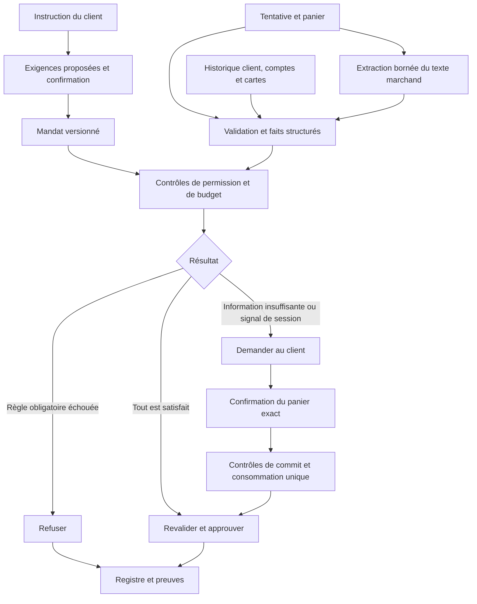

# Propositions de filtres pour le portefeuille de sécurité

> Pour le périmètre actuel, consulter la [spécification unifiée M / C / G](</Users/hedifourati/Documents/Perso/hackathon/St Gall 18:09/viseca-2026/docs/10_SPECIFICATION_UNIFIEE_FILTRES_M_C_G.md>) : filtres retenus, traitement des doutes, confirmations, messages et locks. Le présent document conserve l’analyse initiale.

Analyse du 19 septembre 2026 — données synthétiques Viseca `saw26`, code local et deux dépôts de référence inspectés.

**Recommandation : construire un moteur qui vérifie le mandat, le panier complet et le contexte du client, puis rend une décision explicable `approve`, `decline` ou `step_up`.** Les règles de budget et de permission doivent être exécutées par du code. L’IA peut aider à interpréter la demande et les descriptions, mais elle ne doit ni modifier les permissions ni autoriser elle-même une dépense.

Notre avantage concret est de pouvoir croiser **client → comptes → cartes → historique**, puis confronter ce contexte aux **lignes du panier et aux conditions de l’achat**. C’est ce croisement qu’il faut mettre au centre de la démonstration.

Ce document propose la suite métier. Les anciens documents décrivent le socle et constituent des sources de contexte ; leurs consignes d’implémentation ne sont pas une nouvelle demande à exécuter. Le travail présent est une analyse et une proposition, sans modification du moteur ni des données.

## 1. Ce que je construirais en premier

| Ordre | Fonction | Pourquoi elle mérite sa place |
| --- | --- | --- |
| 1 | Budget par achat et sur sept jours, livraison comprise | Données structurées, résultat vérifiable et démonstration immédiate contre le fractionnement des achats. |
| 2 | Contrôle de chaque ligne du panier | Un marchand autorisé peut vendre un mauvais produit, une carte cadeau ou un abonnement non demandé. |
| 3 | Taille, usage du produit et conditions de retour | Le paiement peut être techniquement valide tout en étant contraire à la demande du client. |
| 4 | Familiarité du marchand au niveau du client et de la carte | Évite de confondre un nouveau vendeur avec un vendeur déjà utilisé sur une autre carte. |
| 5 | Changement d’appareil, rafale d’achats et retour à la normale | Exploite l’historique pour demander une confirmation au bon moment sans bloquer définitivement la session. |
| 6 | Isolation du texte marchand, doublons et nouveaux devis | Protège contre une instruction injectée, une répétition involontaire et la réutilisation d’une ancienne autorisation. |
| 7 | Vue des preuves et confirmation du panier exact | Le client comprend la décision et confirme une dépense précise, utilisable une seule fois. |

Le moteur doit intervenir **après l’émission de chaque tentative dans le run, avant son autorisation**. Un bilan à la fin du run sera utile pour la présentation, mais arriverait trop tard pour empêcher une dépense.

## 2. Les données réellement disponibles

Les onze CSV ont été lus et agrégés. Les **18 empreintes du manifeste sont conformes**, les totaux et conversions des **45 tentatives** ont été recalculés sans divergence, et le validateur existant confirme **45 événements canoniques valides**. Les scénarios ne contiennent aucune décision attendue officielle. Sources : [pack][pack], [dictionnaire][dictionary], [manifeste][metadata].

| Fichier | Lignes vérifiées | Données exploitables | Limite à respecter |
| --- | ---: | --- | --- |
| `customers.csv` | 20 | Région, préférences, style de budget, habitudes et déplacements décrits | Une préférence n’est pas une permission de paiement. |
| `accounts.csv` | 31 | Propriétaire, type débit/crédit/prépayé, usage, statut, plafonds par transaction et mensuel | Aucun solde, crédit disponible ou nom de banque. |
| `cards.csv` | 41 | Compte, usage, statut, dates, `online_enabled`, `international_enabled`, `virtual_card` | Ces statuts décrivent le référentiel actuel ; l’historique a ses propres statuts à la date de l’opération. |
| `merchants.csv` | 58 | Identifiant, nom, catégorie, MCC, pays, ville, disponibilité, capacité de récurrence | Aucun domaine web, avis, score de réputation ou coordonnées GPS. |
| `items.csv` | 66 | Identité et catégorie produit, description générique, prix minimum/typique/maximum en CHF | Pas un inventaire de variantes ; pas une preuve de la taille livrée ou du délai de retour de cette offre. |
| `fx_rates.csv` | 4 | Taux fixes CHF, EUR, GBP, USD vers CHF | Taux synthétiques datés du 1er août 2026, pas des cours en direct. |
| `authorization_history.csv` | 4 701 | Date, résultat, initiateur, compte, carte, marchand, appareil, canal, montant et contexte | Pas de panier historique détaillé, pas d’identité d’agent, pas de label de fraude. |
| `scenario_catalogue.csv` | 5 | Instruction originale du client et contexte du scénario | Le nom, le thème et la position du scénario ne doivent pas déterminer la décision. |
| `scenario_authorities.csv` | 5 | Client, carte, validité et statut de l’autorité de simulation | Ce n’est pas le mandat confirmé par le client. |
| `purchase_attempts.csv` | 45 | Total, livraison, devise, appareil, vélocité, retours, lien vers une tentative antérieure | Le compteur de dépenses de période est vide sur les 45 lignes. |
| `purchase_attempt_items.csv` | 56 | Produit, catégorie, quantité, prix unitaire, description propre à l’offre | `item_details` est du texte marchand non fiable comme instruction. |

Le « profil » a deux sens à séparer : la persona de `customers.csv` fournit du contexte ; le `profile_id` du run est un identifiant de plateforme. Il n’existe pas de fichier contenant un score de confiance du profil. Notre application peut **calculer des statistiques de comportement**, mais doit les présenter comme des calculs locaux. Voir [contrat de l’événement][event-schema] et [documentation technique][technical].

### Constats qui changent les choix de filtres

- L’historique va du **1er septembre 2025 au 31 juillet 2026**. Les tentatives vont du **9 au 22 août 2026** : nous ne disposons pas d’un relevé bancaire exhaustif pour août.
- Parmi les 4 701 lignes : **4 307 achats approuvés**, **258 achats refusés**, **83 retraits** et **53 remboursements**. La familiarité doit partir des achats approuvés, sans assimiler les refus à des achats réalisés.
- **453 achats historiques proviennent d’un agent**, dont 416 approuvés et 37 refusés. `initiator_type=agent` ne signifie donc pas « suspect ». Aucun `agent_id` ne permet de construire une réputation par fournisseur d’agent.
- Les **45 tentatives sont en ecommerce**, sur cartes et autorités actives. Les filtres de carte bloquée ou de canal physique sont utiles à la conception, mais ne distingueront pas ces 45 cas.
- Les 41 cartes ont `online_enabled=true`. Ne pas prétendre démontrer le blocage d’une carte sans paiement en ligne avec une fixture qui n’existe pas.
- **61 opérations historiques étrangères sont facturées en CHF**. Le pays ne détermine pas la devise.
- Le canal historique `mobile_wallet` contient **415 paiements avec carte présente et 197 à distance**. Il ne prouve pas une présence physique.
- Les données sont synthétiques. Les 45 tentatives servent à vérifier des comportements, pas à annoncer un taux de détection de fraude en production.

### Une découverte particulièrement utile : la familiarité entre cartes

Calcul ci-dessous : achats historiques `approved` de type `purchase`, regroupés par identifiant marchand ; périmètre « client » obtenu par les jointures compte/carte, sur toute la période disponible.

| Client et marchand | Sur la carte du run | Sur toutes les cartes du client | Conséquence |
| --- | ---: | ---: | --- |
| `CU0019`, PixelHarbor `ME0022` | 6 | 8 | Marchand connu. |
| `CU0019`, Circuit and Pine `ME0023` | 0 | 2 | Connu du client, nouveau pour `CA0039`. Le mandat dit « un vendeur chez qui j’ai déjà acheté » : le niveau client est pertinent. |
| `CU0019`, HarborByte `ME0024`, États-Unis | 21 | 21 | Un vendeur étranger peut être habituel. |
| `CU0019`, PixelHarbour `ME0059` | 0 | 0 | Le nom proche de PixelHarbor ne lui transmet aucune confiance. |
| `CU0006`, TrailSpark `ME0028` | 22 | 34 | Vendeur habituel de sport. |
| `CU0006`, Summit Thread `ME0029` | 0 | 0 | Nouveau vendeur, mais le mandat des chaussures n’exige pas un vendeur déjà utilisé. |
| `CU0012`, Milano Weave `ME0027`, Italie | 15 | 30 | L’Italie fait partie du comportement observé ; la frontière n’est pas un motif de refus en soi. |

**À implémenter : deux compteurs distincts, `merchant_purchases_on_card` et `merchant_purchases_for_customer`, accompagnés de la dernière date et du périmètre temporel.** Les compteurs précalculés de l’historique sont uniquement au niveau carte ; les prendre tels quels ferait perdre cette distinction.

Preuve vérifiable pour Circuit and Pine : `TR03404` le 2 mai 2026, 149 CHF, et `TR03926` le 7 juin 2026, 139 CHF, tous deux sur `CA0038`. La tentative `AU0044` utilise `CA0039`. Sources : [historique brut][history] et [tentatives][attempts].

## 3. Ce qu’il faut apprendre des dépôts fournis

Les deux dépôts sont des exemples de conception utiles. Leur présence et leurs README ne constituent pas une preuve d’audit de sécurité ou d’usage bancaire en production. J’ai examiné les mécanismes dans le code, sans exécuter leurs services ni reproduire leurs benchmarks.

### Agentic Commerce : reprendre les mécanismes, adapter les hypothèses

Copie locale inspectée : `alex-hahn/agentic-commerce`, commit `b1537bb59d325ae43c8387a441fd17e6a780dd9b`. Son principe pertinent est de continuer à contrôler la dépense même si l’agent est trompé. [Dépôt public](https://github.com/alex-hahn/agentic-commerce), [architecture locale][ac-architecture].

| Mécanisme inspecté | Adaptation pour Viseca |
| --- | --- |
| Politique déterministe et traces des valeurs lues | Chaque filtre produit son résultat, ses preuves et une raison stable. Les plafonds ne dépendent pas d’un raisonnement libre du LLM. [Moteur][ac-policy] |
| Séparation des faits et du texte marchand | Conserver `item_details` avec son origine ; les instructions trouvées dedans n’ont aucune autorité sur le mandat. [Frontière de texte][ac-boundary] |
| Autorisation liée à un panier et consommable une fois | Lier la confirmation à l’achat, au marchand, au montant final, aux conditions, au mandat et à sa version. [Service d’approbation][ac-approvals] |
| Machine à états | Impossible de passer de « en attente » à « approuvé » sans transition validée ; une révocation doit empêcher une approbation encore pendante. |
| Idempotence | Une relivraison du même achat retourne le même résultat ; elle ne dépense pas deux fois. Un achat différent mais ressemblant demande un autre filtre. |
| Journal chaîné et relecture | Commencer par la preuve complète de chaque décision. Ajouter une chaîne de hashes ensuite ; un hash conservé uniquement avec le journal ne protège pas d’une réécriture complète. [Audit][ac-audit] |

Trois adaptations sont importantes :

1. **Ne pas recopier ses seuils.** Ses montants, heures interdites et catégories par défaut appartiennent à sa politique d’exemple. Ici, les montants viennent du mandat ; l’historique peut montrer une activité nocturne habituelle.
2. **Élargir l’empreinte de confirmation.** La fonction locale `cartFingerprint` couvre les lignes et le sous-total. Notre empreinte doit aussi couvrir la livraison, le total, les conditions de retour et les faits déterminants de l’offre : deux chaussures de même `item_id` peuvent avoir des tailles différentes. [Code de l’empreinte][ac-cart]
3. **Ne pas confondre extraction et vérité.** Le dépôt dispose d’attributs structurés du fournisseur. Chez nous, la taille et la durée des retours sont souvent dans une prose marchand. Une extraction JSON bien formée ne prouve pas que le modèle a compris correctement ni que le vendeur dit vrai.

La recherche de produits, les adaptateurs Shopify/Medusa et la chaîne de paiement complète ne sont pas prioritaires : le pack fournit déjà les propositions d’achat. Notre composant est le contrôleur placé entre la proposition et l’autorisation.

### Mandate Agent Control : une séparation utile, un score à ne pas copier

Copie locale inspectée : `arnavkakar/mandate-agent-control`, commit `3a546b2400a7c61c67f7cc929d6b050248002012`.

Son [moteur de politique][mandate-policy] sépare échec d’une règle, revue humaine et approbation. C’est un bon modèle de restitution. Son [score de risque][mandate-risk] additionne des points, par exemple pour un montant supérieur à trois fois la moyenne ou un nouveau marchand. Ces poids ne sont pas calibrés sur nos données. Le code normalise aussi des noms de marchands ; chez nous, **les décisions d’identité doivent utiliser `merchant_id`**.

Je recommande des facteurs explicites avant tout score global : « nouvel appareil », « trois tentatives précédentes en dix minutes », « marchand inconnu du client ». Ils sont compréhensibles et testables. Un éventuel score reste un indicateur de revue et ne compense jamais une règle obligatoire échouée.

### Vérification complémentaire : AP2 et ACP

La documentation actuelle d’**AP2** distingue des mandats de checkout et de paiement, ouverts pour les contraintes puis fermés pour une transaction précise. J’en retiens, pour notre conception, la séparation entre permission générale et consentement à l’achat final. Notre mandat local n’est pas pour autant un mandat AP2 signé. [Documentation AP2](https://ap2-protocol.org/)

**ACP** documente le cycle du checkout, l’état faisant foi du panier et l’idempotence. Il fournit une référence pour une future intégration marchand ; il ne remplace pas notre décision sur le droit de l’agent à dépenser. Le schéma Viseca reste notre contrat immédiat. [RFC Agentic Checkout](https://github.com/agentic-commerce-protocol/agentic-commerce-protocol/blob/main/rfcs/rfc.agentic_checkout.md)

## 4. Traduction de tes notes manuscrites

Le tableau reprend les idées lisibles de la photo et précise leur application. La mention de marge de **7 %** est traitée comme une piste proposée, pas comme un seuil déjà autorisé par les clients.

| Idée de la photo | Proposition avec nos données | Faisabilité |
| --- | --- | --- |
| Opération sur le prix, marge et confirmation | Comparer total fourni, frais et CHF au plafond ; comparer séparément le prix unitaire à une référence. Une marge commerciale peut déclencher une revue, jamais augmenter silencieusement le plafond. | Direct pour le montant ; seuil d’anomalie à définir. |
| Utilisation régulière d’Internet / de la carte | Part des achats à distance, appareils utilisés et ancienneté des achats en ligne. Ne pas déduire « utilisation régulière d’Internet » d’un historique de paiements seulement. | Indicateurs de paiement calculables. |
| Nombre et fréquence des transactions | Compter les tentatives récentes, les achats approuvés et la fréquence du marchand séparément. | Direct, avec fenêtres explicites. |
| Reconnaître le marchand grâce à l’historique | Jointure par `merchant_id`, aux niveaux carte et client. Nom ressemblant = indice de confusion, jamais identité commune. | Très pertinent. |
| Description de l’article : correspond-elle à ce qui a été demandé ? | Comparer produit, usage, taille, quantité, retours et ajouts à chaque exigence du mandat. Repérer les instructions injectées. | Mixte : données structurées et extraction prudente. |
| Distance entre client et marchand | Préférer pays/catégorie habituels. Région de domicile et ville du vendeur ne donnent pas la localisation de la personne ; les 45 achats sont en ligne. | Distance réelle indisponible ; priorité faible. |
| Site en ligne / autre pays | Utiliser le canal de l’achat et les capacités de la carte. `availability` décrit le marchand ; ni sa ville ni sa devise ne suffisent à classer l’achat. | Direct avec ces réserves. |
| Abonnement et type de carte | Repérer l’engagement récurrent dans le panier. Vérifier la carte, mais ne pas inventer une interdiction universelle « abonnement + débit/prépayé ». | Récurrence partiellement dans le texte ; règle de carte à confirmer si souhaitée. |
| Statut de la carte | Refuser l’inactivité ou l’incompatibilité constatée à la date de la tentative. | Direct ; ajouter des cas de test distincts car les 45 cartes de tentative sont actives. |

## 5. Catalogue de 24 filtres proposés

**P0** = premier moteur démontrable ; **P1** = extension utile ; **P2** = amélioration après validation du cœur. Les comportements ci-dessous sont des recommandations de produit. Une limite du client est une règle dure ; une anomalie statistique est un signal. Les seuils heuristiques doivent être versionnés et visibles.

### 5.1 Intégrité et permission

| ID | Priorité | Filtre et données | Comportement proposé |
| --- | --- | --- | --- |
| F01 | P0 | Cohérence d’identité : autorité → carte → compte → client ; identités du mandat et du run | Incohérence ou mandat révoqué : aucune approbation. Évaluer les dates de fixture avec le temps simulé, pas avec la date du jour. |
| F02 | P0 | Statut compte/carte, `card_status_at_attempt`, dates, `online_enabled`, `international_enabled` | Incompatibilité certaine : refus. Le pays de référence de la carte doit être une convention explicite du prototype suisse ; aucun pays d’émission n’est fourni. L’expiration est dans `cards.expires_on`, pas dans l’enum de `card_status_at_attempt`. |
| F03 | P0 | Sous-total = somme des lignes ; total = sous-total + livraison ; conversion CHF | Incohérence : erreur d’intégrité, pas d’approbation. Calcul décimal et arrondi half-even. Le chargeur valide déjà ces éléments ; conserver ce contrôle à l’entrée du moteur. |
| F04 | P0 | Couverture du mandat : instruction, exigences interprétées, règles et version confirmées | Une exigence obligatoire non traduite interdit l’approbation automatique. En inspection, conserver `not_evaluated` ; en évaluation, suivre le chemin d’incertitude. |

### 5.2 Budget et panier

| ID | Priorité | Filtre et données | Comportement proposé |
| --- | --- | --- | --- |
| F05 | P0 | Plafond par achat sur `billing_amount_chf`, livraison incluse ; plafond du mandat et `accounts.per_transaction_limit_chf` | Respecter les deux plafonds, donc le minimum lorsqu’ils sont exprimés en CHF. Dépassement certain : `decline`. Ex. `AU0004` vaut 126 CHF contre 120, même si les articles seuls valent 118. |
| F06 | P0 | Budget glissant : mandat, dates simulées, décisions finales du registre | Additionner les achats approuvés dans la fenêtre, puis le candidat. Empêche de contourner 300 CHF par plusieurs commandes sous 120 CHF. |
| F07 | P0 | Catégorie de **chaque article**, comparée au but confirmé | Un supermarché peut vendre des cosmétiques ; un vendeur d’électronique peut vendre une carte cadeau. `AU0007` et `AU0043` montrent pourquoi le MCC seul ne suffit pas. |
| F08 | P0 | Identité et caractéristiques : `item_id`, catégorie, `item_details`, quantité | Mauvaise taille ou mauvais usage établis : refus ; caractéristique nécessaire introuvable : revue. Même `IT0014` peut désigner taille 42 ou 43 dans les tentatives. |
| F09 | P0 | Conditions : `order_returnable` et durée extraite de `item_details` | Retour impossible ou inférieur aux 14 jours demandés : refus. `unknown` : `step_up`. `true` seul ne prouve pas une fenêtre suffisante. |
| F10 | P0 | Extras et quantité : toutes les lignes du panier contre les produits autorisés | Ajouter une protection, un abonnement ou une deuxième unité exige une permission correspondante. Aucun supplément n’est autorisé parce qu’il reste sous le plafond. |
| F11 | P0 | Type de vendeur : `merchant_category`, MCC, mandat | Pour les chaussures, contrôler le spécialiste sportif en plus du produit. `AU0022` contient les bonnes chaussures mais le marchand est `sustainable_goods`. |
| F12 | P1 | Anomalie de prix : `unit_price × fx`, fourchette de `items.csv` | Alerte si prix atypique ; pas de refus arbitraire à +7 %. Un prix dans la fourchette ne prouve pas le respect du plafond du client. |
| F13 | P1 | Livraison et échéance : `fulfillment_method`, `delivery_by`, frais, mandat | Contrôler une livraison ou une échéance seulement si elle est demandée. Échéance requise et absente : incertitude. Ne pas inventer d’adresse ou de distance. |
| F14 | P1 | Engagement futur : catégorie `subscriptions`/`membership`, prose de l’offre | Signaler la récurrence et vérifier le consentement. `AU0018` mentionne une facturation mensuelle après la première année. Le futur montant et la durée ne sont pas assez définis pour calculer un coût total fiable. |

### 5.3 Contexte du client

| ID | Priorité | Filtre et données | Comportement proposé |
| --- | --- | --- | --- |
| F15 | P0 | Marchand connu : achats approuvés par `merchant_id`, carte et client | Si le mandat exige un vendeur déjà utilisé et le périmètre historique choisi ne contient aucun achat : filtre de familiarité échoué. Sinon, nouveauté seule = information, pas refus automatique. |
| F16 | P0 | Appareil nouveau : `customer_device_id` et historique antérieur | Nouveau pour la carte, puis nouveau pour le client : niveaux distincts. Dans le mandat de session, proposer `step_up` pour un appareil totalement nouveau. Un identifiant connu n’est pas une authentification forte. |
| F17 | P0 | Vélocité : `recent_attempt_count_10m`, dates et registre | La valeur compte les tentatives précédentes, même refusées. Point de départ expérimental : revue à partir de 3 tentatives précédentes/10 min ; à confirmer, pas une vérité du pack. |
| F18 | P1 | Pays et horaire inhabituels : achats antérieurs, `merchant_country`, timestamp | Indices complémentaires. Comparer aux habitudes observées ; aucun blocage universel de nuit ou à l’étranger. Convertir les heures vers un fuseau explicite pour les habitudes, garder UTC pour les fenêtres. |
| F19 | P1 | Montant inhabituel contextualisé : historique par client/carte et catégorie | Comparer à une médiane et des quantiles, avec nombre d’observations. Minimum proposé de 20 achats comparables ; sinon afficher « historique insuffisant ». Ne pas utiliser une moyenne tous achats confondus pour condamner un moniteur. |
| F20 | P1 | Usage du compte/carte : `account_purpose`, `card_purpose`, mandat | Proposer une séparation personnel/professionnel/voyage ; appliquer un refus seulement si le client l’a explicitement adoptée. Ne pas changer de carte automatiquement pour contourner une limite. |

### 5.4 Manipulation et répétition

| ID | Priorité | Filtre et données | Comportement proposé |
| --- | --- | --- | --- |
| F21 | P0 | Instruction dans le texte marchand : `item_details` et provenance | Le texte ne peut ni relever un budget ni affirmer un consentement. Conserver l’extrait, signaler la tentative ; `decline` si une règle dure échoue, sinon `step_up` proposé pour un contenu explicitement manipulateur. |
| F22 | P0 | Ressemblance de vendeur : nom normalisé + identifiant distinct + familiarité | Afficher la confusion possible entre PixelHarbor et PixelHarbour ; le verdict de vendeur connu vient de F15, jamais d’une comparaison floue des noms. |
| F23 | P0 | Achat répété : registre complet du run, panier comparable, marchand, client, date et statut | Autre ID, panier équivalent, premier achat approuvé ou encore en attente : `step_up` proposé. Un refus antérieur ne constitue pas une dépense. Fenêtre initiale proposée : 60 min ; tester aussi le besoin déjà satisfait au niveau de la mission. |
| F24 | P0 | Nouveau devis : `related_authorization_id`, statut effectif local, différences de panier/prix | Réévaluer l’offre corrigée ; ne pas hériter automatiquement du refus précédent. Ne jamais réutiliser une confirmation dont le contenu a changé. |

**Précondition transversale :** même identifiant relivré = traitement idempotent. Ce cas technique est distinct du doublon métier F23, qui compare deux achats ayant des identifiants différents.

## 6. Les décisions délicates à concevoir correctement

### 6.1 Budget glissant et fractionnement

Pour le mandat courses, adopter explicitement cette convention V1 : budget des achats approuvés **dans le run et sous le mandat concerné**, en CHF, sur les 168 heures précédentes. Un budget réel partagé entre plusieurs mandats demanderait ensuite un registre commun.

```text
T = timestamp simulé de l’achat candidat
dépense(T) = somme des achats approuvés dont T − 168 h ≤ timestamp < T
autorisation possible si dépense(T) + montant candidat ≤ 300 CHF
et montant candidat ≤ 120 CHF
```

Le registre exclut le candidat par son identifiant. Si deux événements ont le même timestamp, utiliser leur ordre d’émission pour inclure les achats déjà décidés à cet instant. La borne exacte à sept jours est une convention explicite à tester.

Illustration calculée sur `SCEN0001`, en supposant que seuls les achats conformes au mandat sont approuvés, sans réponse humaine qui change la trajectoire :

| Achat | Montant CHF | Dépense avant, sur sept jours | Proposition et motif |
| --- | ---: | ---: | --- |
| `AU0002` | 44,50 | 0,00 | Approuver si les autres contrôles passent. |
| `AU0003` | 120,00 | 44,50 | Approuver : le plafond inclusif est respecté. |
| `AU0004` | 126,00 | 164,50 | Refuser : dépassement par achat. |
| `AU0005` | 70,00 | 164,50 | Approuver ; cumul 234,50. |
| `AU0006` | 65,00 | 234,50 | Approuver ; cumul 299,50. La proximité de deux achats n’est pas un dépassement à elle seule. |
| `AU0007` | 62,00 | 299,50 | Refuser : cumul et cosmétique hors du panier de courses défini. |
| `AU0008` | 65,50 | 299,50 | Refuser : cumul 365,00. |
| `AU0009` | 24,00 | 299,50 | Refuser : cumul 323,50. |
| `AU0010` | 138,00 | 255,00 | Refuser : plafond par achat et cumul. `AU0002` est sorti de la fenêtre. |
| `AU0011` | 88,00 | 135,00 | Approuver ; cumul 223,00. `AU0003` est également sorti. |

Ce tableau est une **trajectoire proposée**, pas un corrigé Viseca. Il montre pourquoi additionner toutes les tentatives, ou laisser entrer les refus dans le budget, serait incorrect.

Ne pas employer `approved_spend_before_chf` comme budget mensuel : il cumule l’historique entier de la carte, avec remboursements. Ne pas remplacer les 45 `spend_in_period_before_chf=null` par une dépense observée de zéro. Pour notre budget de run, zéro initial résulte de la convention de périmètre ; il ne signifie pas « le compte n’a rien dépensé en août ».

Les plafonds du compte sont distincts : vérifier le plafond par transaction est direct ; le reste à dépenser réellement sur le mois n’est pas connu avec un historique qui s’arrête en juillet. Afficher « dépense observée » et la couverture des données, jamais un faux « solde disponible ».

**Approbations humaines concurrentes :** une demande en attente peut réserver du budget dans un registre séparé, sans être comptée comme approuvée. À la validation finale, recalculer atomiquement le budget, exclure sa propre réservation, consommer celle-ci une fois et persister la décision. Libérer la réservation au refus, à l’expiration ou à la révocation. Pour une réponse tardive attachée à une ancienne date simulée, vérifier également les fenêtres ultérieures affectées ; le démarrage le plus simple est une émission séquentielle tant qu’un achat attend la réponse humaine. Ce choix simplifie la V1 et modifierait le parcours non bloquant envisagé dans le document de structure.

### 6.2 Exigences textuelles et sécurité de l’extraction

Exemple : « chaussures de running sur route, taille 43, retours au moins 14 jours, spécialiste sportif, au plus 200 CHF » devient **cinq vérifications indépendantes**. L’app montre les exigences avant confirmation. Elle ne doit pas faire disparaître « sur route » après avoir trouvé la catégorie `sporting_goods`.

Pour les formes simples présentes dans le pack, commencer par une extraction déterministe bornée de la taille et des durées. Toute formulation non reconnue, contradictoire ou multiple devient `unknown` ou `ambiguous`. Un modèle peut proposer des observations avec l’extrait et sa position, mais ses sorties sont validées et son niveau de confiance ne vaut pas preuve.

Conserver trois niveaux d’origine : **permission confirmée par le client**, **donnée structurée reçue du pack**, **déclaration du marchand extraite du texte**. Valider le JSON ne rend pas une déclaration marchand indépendante ou authentifiée. Dans une future connexion réelle, la provenance du montant et des identifiants devra aussi être authentifiée côté serveur.

Le catalogue générique ne remplace pas les conditions de l’offre : `items.csv` indique des tailles standard, tandis que `AU0013` dit taille 42. La contradiction ou l’absence dans l’offre ne peut pas être réparée en inventant un attribut depuis le catalogue.

De même, « le moniteur que j’ai choisi » ne fournit pas une référence externe de modèle, une marque ou un SKU. Le prototype peut faire confirmer la correspondance avec le produit du catalogue et les 27 pouces ; il ne peut pas prouver une sélection détaillée absente des données. Les descriptions des offres sont consultables dans les [lignes de panier][attempt-lines], et les exigences originales dans les [instructions de scénario][scenarios].

### 6.3 Familiarité et évolution de la session

« Chez qui j’ai déjà acheté » peut être traduit, après confirmation de ce sens, par au moins un achat historique approuvé du **client** chez ce marchand. « Régulièrement » est différent : proposition initiale de trois achats à des dates distinctes sur 180 jours, à présenter comme seuil réglable et à calculer séparément des comptes sur onze mois donnés plus haut.

Le profil historique de `CA0023` contient **51 achats approuvés** sur `DVC-B73E47`. `DVC-4C0E9B` n’est pas un appareil historique du client. Les tentatives `AU0026` à `AU0030` permettent d’expliquer un changement de session ; `AU0031` revient à l’appareil connu avec vélocité nulle.

Ne pas transformer chaque achat approuvé automatiquement en preuve indépendante de confiance : cela permettrait à une session compromise de devenir « familière » par répétition. Pour la V1, garder le profil historique de référence gelé au début du run, et le compléter seulement par des confirmations humaines explicites et tracées. Les dépenses, elles, continuent à actualiser le registre budgétaire.

### 6.4 Injection, doublon et nouveau devis sont trois problèmes différents

- `AU0037` coûte **520 CHF** et son texte prétend relever l’autorisation à 900 CHF. Le plafond de 400 suffit à refuser, même si le détecteur d’injection manque l’attaque.
- `AU0040` coûte **299 CHF** mais contient une instruction qui tente de forcer l’approbation. Le prix acceptable ne neutralise pas cette manipulation ; revue proposée selon F21.
- `AU0035` et `AU0036` présentent le même moniteur à 289 CHF, chez le même marchand, à **25 minutes d’écart**. La fenêtre de contexte de dix minutes ne suffit pas à voir le doublon ; utiliser le registre complet du run.
- `AU0042` présente un nouveau prix de **350 CHF** lié à `AU0037`. Consulter le résultat réel enregistré pour l’achat précédent et réévaluer le nouveau panier. Le statut `declined` fourni par la fixture est une information source, pas un substitut au résultat de notre run.

Le besoin « remplacer mes chaussures » ou « acheter le moniteur choisi » suggère aussi une mission ponctuelle. Il faut faire confirmer sa quantité totale et sa durée : la fenêtre anti-doublon de 60 minutes ne protège pas d’un deuxième moniteur le lendemain. Le pack ne fournit ni `goal_id` ni preuve de commande livrée ; ne pas présenter une mission réellement accomplie comme une donnée disponible. La V1 peut conserver le cumul des quantités autorisées localement et demander une revue si une demande ponctuelle paraît déjà satisfaite.

## 7. Proposition de fonctionnement du moteur et de la web app



Priorité de décision proposée :

1. Événement invalide, identité incohérente ou moteur non prêt : aucune approbation ; distinguer erreur technique et refus métier dans l’audit.
2. Une règle obligatoire échoue : `decline`, même si tous les signaux de comportement sont rassurants.
3. Une exigence est inconnue ou ambiguë, ou un contrôle de session demande une confirmation : `step_up` avec la politique `ask` des cinq instructions publiques.
4. Toutes les exigences sont couvertes et satisfaites : `approve`, sous réserve des contrôles atomiques finaux.

Le contrat officiel admet aussi `uncertainty_policy=approve`. La V1 recommandée n’active pas cette option pour une exigence obligatoire non interprétée ou une erreur technique ; ses conditions d’emploi devront être explicites avant de l’exposer. Un bouton de confirmation ordinaire ne doit pas contourner une carte bloquée, un mandat révoqué ou un plafond dur : un changement de permission suit un parcours distinct et versionné.

### Ce qu’il faut afficher après chaque tentative

| Élément | Exemple de contenu utile |
| --- | --- |
| Décision | « Refusé : total supérieur au plafond » |
| Calcul | « Articles 118 CHF + livraison 8 CHF = 126 CHF ; plafond 120 CHF » |
| Exigences | Produit conforme / retour inconnu / vendeur connu du client |
| Origine | Fichier, ligne, champ ou extrait exact de l’offre |
| Historique | « 0 achat sur cette carte ; 2 achats sur les autres cartes du client » |
| Budget | Dépensé, réservé en attente, montant candidat et plafond, avec périmètre indiqué |
| Confirmation | Panier complet, marchand, montant, frais, conditions et raison de la demande |

Le panneau d’explication doit permettre de distinguer **satisfait**, **échoué**, **inconnu**, **non applicable** et **non évalué**. Un score vert ou rouge unique masque trop d’informations.

### Contrats locaux à ajouter

Conserver le [schéma officiel][event-schema] intact. Stocker à côté de l’événement : les observations extraites, les résultats des filtres, les versions et les preuves. Le champ `field` d’une règle officielle est une chaîne, mais cela ne veut pas dire que n’importe quel chemin est déjà implémenté : définir un registre de champs et refuser les références inconnues.

Proposition de résultat par filtre :

```ts
type FilterResult = {
  code: string;
  outcome: "pass" | "fail" | "unknown" | "not_applicable";
  kind: "integrity" | "hard_rule" | "review_signal";
  observed: unknown;
  expected: unknown;
  evidence: Array<{
    source: string;
    field: string;
    row_id?: string;
    excerpt?: string;
  }>;
  version: string;
};
```

Les valeurs `unknown` du type TypeScript restent du JSON borné et validé. Chaque preuve est reliée à une ligne précise ; chaque filtre conserve sa version. Ajouter un registre distinct de résolution humaine, sans réécrire la décision initiale `step_up`.

L’empreinte de confirmation devrait couvrir au minimum : identité client/carte, ID d’achat, mandat/version, marchand, devise, lignes et quantités, prix, frais, total CHF, conditions et description source déterminante. La confirmation expire, n’est utilisable qu’une fois et devient invalide si un de ces éléments change. Une signature cryptographique distribuée est une extension ; un registre serveur fiable avec contrôle de version suffit à démontrer cette propriété en local. Il faut également empêcher l’agent d’appeler le canal réservé au client ; signer un objet ne résout pas à lui seul cette séparation d’accès.

### Écart réel avec le code actuel

Le code présent possède le chargeur, les événements, les mandats manuels, l’idempotence HTTP et les runs d’inspection. Il ne possède pas encore les décisions métier envisagées dans les documents.

| Point inspecté | État constaté | Modification nécessaire ensuite |
| --- | --- | --- |
| [Contrats de run][run-contract] | `mode: "inspection"`, statuts d’achat `pending/cancelled`, compteurs approuvé/refusé à zéro | Ajouter les états et résultats d’évaluation, sans changer la signification des anciennes inspections. |
| [Service de run][run-service] | Le mode autre qu’inspection est refusé | Brancher analyse, décision, attente humaine et finalisation dans la file de commandes. |
| [Construction d’événement][event-builder] | `approved_spend_in_period_chf` reste `null` | Calculer le contexte depuis les décisions réelles avec une convention de période enregistrée. |
| [Stockage du run][run-store] | Valide explicitement `not_evaluated` et les statuts actuels | Versionner le format et prévoir la lecture des anciens runs avant de persister de nouveaux états. |
| [Routes][routes] | La route `/resolve` existe mais appelle le refus de disponibilité | Implémenter une résolution réelle, avec révision attendue, expiration et contrôle final. |
| [Interface][web-app] | Affiche « Non évalué » et les descriptions | Ajouter résultats des filtres, budget et confirmation contextualisée. |

Une implémentation cohérente doit donc modifier les contrats et le stockage, pas seulement ajouter des cartes visuelles après « Run ».

## 8. Cas de démonstration à préparer

Ces conclusions sont des **comportements recommandés sous le mandat interprété et confirmé**, pas des étiquettes officielles. Un « éligible » reste conditionné aux autres filtres et aux achats précédemment approuvés, notamment pour un besoin ponctuel.

| Cas du pack | Ce que la démonstration doit montrer |
| --- | --- |
| `AU0001` | 20 CHF exactement respecte « 20 CHF ou moins » ; la livraison est déjà incluse. Vérifier aussi la régularité du marchand selon la convention choisie. |
| `AU0004` | Refus à 126 CHF, même si le sous-total est sous 120. |
| `AU0006` puis `AU0008` | Passer à 299,50 CHF est permis ; l’achat suivant de 65,50 ferait dépasser le budget. |
| `AU0007` | Montrer la ligne cosmétique ; « marchand groceries » ne suffit pas. |
| `AU0013`, `AU0015`, `AU0016` | Taille 42 : refus ; retour 7 jours : refus ; retour inconnu : demande au client. |
| `AU0017`, `AU0020` | Une chaussure de trail et un casque ne sont pas les chaussures de route demandées. |
| `AU0018` | À 194 CHF, l’achat reste sous le plafond mais ajoute un service non demandé et potentiellement récurrent. |
| `AU0019` | Le seuil de 14 jours est inclusif ; ne pas exiger plus de 14 jours. |
| `AU0023` | Un nouveau spécialiste conforme reste éligible ; aucune exigence de familiarité n’existe dans ce mandat. |
| `AU0025`, `AU0032` | 199 EUR = 189,05 CHF ; 260 EUR = 247 CHF. L’Italie et une valeur numérique de 260 ne prouvent aucun dépassement de 250 CHF. |
| `AU0026` à `AU0030` | Expliquer chaque changement : appareil nouveau, marchands inconnus, rafale. Une règle dure de familiarité peut déjà imposer le refus, indépendamment du signal de session. |
| `AU0031` puis `AU0034` | Le retour au contexte connu doit lever une alerte temporaire ; 268 CHF dépasse néanmoins le plafond de 250. |
| `AU0035` / `AU0036` | La deuxième tentative à 25 minutes doit être examinée si la première est approuvée ou pendante. |
| `AU0037` | L’injection ne modifie jamais le plafond de 400 CHF. |
| `AU0038` | 450 USD = 391,50 CHF ; le vendeur américain est connu du client. |
| `AU0039` | PixelHarbour n’est pas PixelHarbor : IDs et historiques différents. |
| `AU0042` | Le nouveau devis à 350 CHF mérite une nouvelle évaluation ; vérifier aussi que la mission n’a pas déjà donné lieu à un achat autorisé. |
| `AU0043` | Une carte cadeau à 195 CHF n’est pas le moniteur demandé. |
| `AU0044` | Circuit and Pine est connu sur une autre carte : montrer les deux achats historiques correspondants. |

## 9. Ordre d’implémentation proposé

| Lot | Travail | Critère de sortie |
| --- | --- | --- |
| A — Exigences et contrat | Définir les exigences revues, résultats de filtres, états de décision et migration du stockage | Un mandat incomplet ne peut pas produire d’approbation automatique ; anciens runs toujours lisibles. |
| B — Cœur déterministe | F01–F07, contrôles structurés de F08/F10/F11, FX, registre budgétaire et preuves | Le scénario courses produit un calcul reconstituable ; refus et doublons techniques ne consomment pas le budget. |
| C — Offre et contexte | Extraction bornée F08/F09, familiarité F15, appareil/vélocité F16/F17, F21–F24 | Les cas chaussures, session et manipulation sont expliqués sans décision codée par ID de scénario. |
| D — Confirmation sûre | `step_up`, panier figé, délai, contrôle de version, revalidation, consommation unique et révocation | Deux réponses ou deux appels concurrents ne produisent qu’une finalisation ; aucun dépassement tardif du budget. |
| E — Démonstration et extensions | UI des preuves, relecture, filtres P1 et journal renforcé P2 | La démo montre un achat autorisé, un refus justifié et une incertitude résolue, avec provenance. |

Pour garder la démo offline, les mandats peuvent d’abord être structurés manuellement et explicitement marqués comme tels. Ensuite, un interpréteur IA propose une compilation que le client révise. Il ne faut pas présenter ces fixtures manuelles comme une compréhension automatique déjà réalisée.

Une seule instance locale et la file de commandes existante suffisent au premier moteur. Une base distribuée, une intégration bancaire, un vrai moyen de paiement et un serveur MCP supplémentaire ne sont pas nécessaires à cette phase.

### Vérifications qui auront de la valeur

- Rejouer les 45 événements avec une politique et une trajectoire humaine explicites ; comparer preuves et invariants, pas un taux de réussite contre des réponses inexistantes.
- Muter les cas aux frontières : 120,00/120,01 CHF ; 14/13 jours ; exactement sept jours ; taille manquante ; deux articles au lieu d’un.
- Vérifier qu’augmenter le montant, ajouter un article interdit ou réduire la durée des retours ne transforme jamais un refus en approbation.
- Vérifier qu’une description qui ordonne d’approuver ne peut ni augmenter un budget ni remplir une exigence manquante. Inclure des formulations non prévues par les détecteurs.
- Tester deux validations simultanées, réponse après expiration, mandat révoqué, modification du panier, répétition HTTP et reprise après arrêt.
- Tester `unknown` contre `false` et `not_applicable`, nouveau marchand autorisé par le mandat, appareil nouveau mais non automatiquement frauduleux, et familiarité entre cartes.
- Mesurer séparément latence, demandes humaines et erreurs d’extraction. Les 8 secondes et 120 secondes documentées sont des valeurs par défaut ; une intégration live doit lire la configuration et respecter la deadline reçue. [Contrat technique][technical]

## 10. Idées fortes pour aller plus loin et limites des données

**1. Un historique de confiance explicable entre les cartes du client.** C’est déjà démontrable avec Circuit and Pine. Il répond à une question concrète : « Ce vendeur est-il nouveau pour cette carte, ou nouveau pour moi ? » La confiance ne se transmet pas entre personnes.

**2. Des permissions par besoin.** Un plafond seul autorise plusieurs mauvais achats. Associer un besoin confirmé, une quantité maximale et un état local de consommation à un mandat permettrait de protéger « une paire de chaussures » ou « un moniteur ». Ce sont de nouvelles données applicatives à créer ; la livraison et le règlement réels restent inconnus.

**3. Une mesure du risque d’engagement.** Distinguer achat ponctuel, souscription, bon d’achat et extension optionnelle rend visible un risque que le montant immédiat cache. Le pack permet de montrer l’engagement potentiel ; il ne permet pas de calculer systématiquement son coût annuel.

**4. Une explication de ce qui manque pour autoriser.** Exemple : « Le prix et la taille conviennent ; le vendeur ne précise pas la durée des retours. » Pour un refus dur : « Ce panier contient un supplément non demandé. » Le contrôleur peut expliquer la correction nécessaire sans modifier lui-même le panier ou assouplir le mandat.

**5. Des alertes adaptées au comportement observable.** Les personas illustrent des horaires de travail atypiques, des voyages fréquents et des achats rares mais planifiés. Utiliser les données observées pour contextualiser les alertes, sans imposer de restrictions à partir du nom, du métier supposé ou du texte de persona.

| Idée séduisante | Ce qui manque | Version honnête réalisable |
| --- | --- | --- |
| Solde disponible / solvabilité | Soldes, encours, engagements réels | Plafonds et dépenses observées avec couverture indiquée. |
| Réputation de l’agent | Identité et authentification de l’agent | Statistiques `human`/`agent`, sans classement par agent. |
| Réputation Internet du vendeur | URL, domaine, avis et preuve de contrôle du vendeur | Identifiant du pack, familiarité et ressemblance de noms. |
| Distance et voyage impossible | Géolocalisation client/appareil fiable | Contexte pays/canal ; aucune inférence de déplacement physique à partir d’un achat en ligne. |
| Détection de fraude supervisée | Labels fiables et échantillon représentatif | Contrôles de mandat et signaux descriptifs ; pas de probabilité de fraude annoncée. |
| Budget bancaire global en temps réel | Activité exhaustive de tous les comptes après juillet | Budget local du run et calculs historiques explicitement bornés. |
| Autorisation cryptographique interopérable complète | Identités signées, clés, canal client authentifié et intégration fournisseur | Confirmation locale du panier exact ; AP2 comme piste ultérieure. |

Le cœur différenciant à présenter est donc : **« Nous vérifions que cet achat correspond à votre demande, reste dans vos limites et s’inscrit dans un contexte compréhensible, avec les preuves de chaque décision. »**

## Sources locales et périmètre de vérification

Analyse fondée sur les CSV eux-mêmes, leurs jointures, le code local, les documents [structure des données][structure] et [plan d’action][plan], ainsi que la photo transmise. La vérification web complémentaire des références publiques a été faite le 19 septembre 2026. Les résultats de tests annoncés par les dépôts externes n’ont pas été reproduits ici.

Commande de validation exécutée avec succès dans le projet :

```bash
node --import tsx ./apps/offline-runner/src/main.ts validate-data
# Pack saw26 valide: 18 empreintes, 5 scénarios, 45 événements canoniques.
```

[pack]: </Users/hedifourati/Documents/Perso/hackathon/St Gall 18:09/viseca-2026/data/README.md>
[dictionary]: </Users/hedifourati/Documents/Perso/hackathon/St Gall 18:09/viseca-2026/data/data_dictionary.md>
[metadata]: </Users/hedifourati/Documents/Perso/hackathon/St Gall 18:09/viseca-2026/data/metadata.json>
[history]: </Users/hedifourati/Documents/Perso/hackathon/St Gall 18:09/viseca-2026/data/authorization_history.csv>
[attempts]: </Users/hedifourati/Documents/Perso/hackathon/St Gall 18:09/viseca-2026/data/purchase_attempts.csv>
[attempt-lines]: </Users/hedifourati/Documents/Perso/hackathon/St Gall 18:09/viseca-2026/data/purchase_attempt_items.csv>
[scenarios]: </Users/hedifourati/Documents/Perso/hackathon/St Gall 18:09/viseca-2026/data/scenario_catalogue.csv>
[event-schema]: </Users/hedifourati/Documents/Perso/hackathon/St Gall 18:09/viseca-2026/data/schemas/authorization_event.schema.json>
[technical]: </Users/hedifourati/Documents/Perso/hackathon/St Gall 18:09/viseca-2026/technical_details.md>
[structure]: </Users/hedifourati/Documents/Perso/hackathon/St Gall 18:09/viseca-2026/docs/02_STRUCTURE_DONNEES.md>
[plan]: </Users/hedifourati/Documents/Perso/hackathon/St Gall 18:09/viseca-2026/docs/04_PLAN_ACTION.md>
[ac-architecture]: </Users/hedifourati/Documents/Perso/hackathon/St Gall 18:09/agentic-commerce-repos/agentic-commerce/docs/architecture.md>
[ac-policy]: </Users/hedifourati/Documents/Perso/hackathon/St Gall 18:09/agentic-commerce-repos/agentic-commerce/src/policy/engine.ts>
[ac-boundary]: </Users/hedifourati/Documents/Perso/hackathon/St Gall 18:09/agentic-commerce-repos/agentic-commerce/src/safety/boundary.ts>
[ac-approvals]: </Users/hedifourati/Documents/Perso/hackathon/St Gall 18:09/agentic-commerce-repos/agentic-commerce/src/approvals/service.ts>
[ac-cart]: </Users/hedifourati/Documents/Perso/hackathon/St Gall 18:09/agentic-commerce-repos/agentic-commerce/src/session/cartHash.ts>
[ac-audit]: </Users/hedifourati/Documents/Perso/hackathon/St Gall 18:09/agentic-commerce-repos/agentic-commerce/src/audit/log.ts>
[mandate-policy]: </Users/hedifourati/Documents/Perso/hackathon/St Gall 18:09/agentic-commerce-repos/mandate-agent-control/services/api/src/policy.ts>
[mandate-risk]: </Users/hedifourati/Documents/Perso/hackathon/St Gall 18:09/agentic-commerce-repos/mandate-agent-control/services/api/src/risk.ts>
[run-contract]: </Users/hedifourati/Documents/Perso/hackathon/St Gall 18:09/viseca-2026/packages/contracts/src/run.ts>
[run-service]: </Users/hedifourati/Documents/Perso/hackathon/St Gall 18:09/viseca-2026/packages/local-runtime/src/services/run-service.ts>
[event-builder]: </Users/hedifourati/Documents/Perso/hackathon/St Gall 18:09/viseca-2026/packages/local-runtime/src/data/event-builder.ts>
[run-store]: </Users/hedifourati/Documents/Perso/hackathon/St Gall 18:09/viseca-2026/packages/local-runtime/src/storage/run-file-store.ts>
[routes]: </Users/hedifourati/Documents/Perso/hackathon/St Gall 18:09/viseca-2026/apps/local-web/src/routes.ts>
[web-app]: </Users/hedifourati/Documents/Perso/hackathon/St Gall 18:09/viseca-2026/apps/local-web/web/app.ts>
