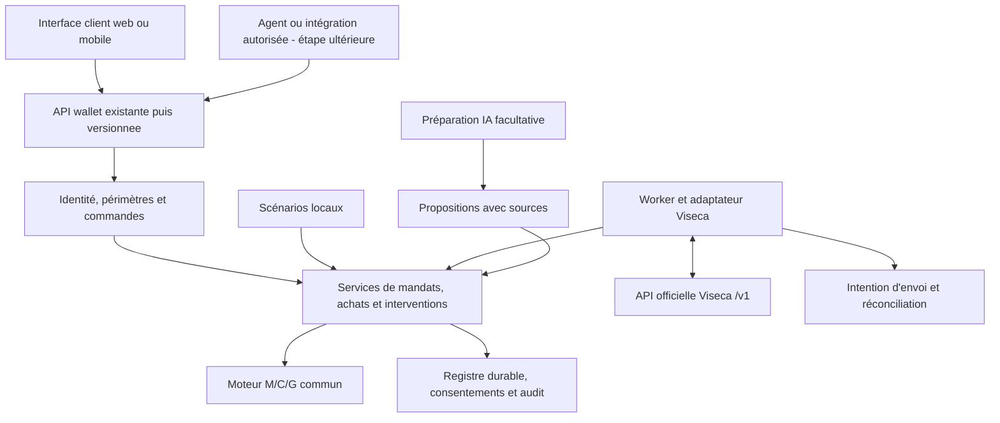

# Suite du projet : expérience client, qualité et API

Date : 19 septembre 2026. **Révision 2, vérification du 19 septembre vers 05 h 50 CEST.** Statut : plan de consolidation du wallet en cours de livraison, puis d’évolution de son API. Ce document ne lance aucune implémentation et ne remplace pas la spécification métier du document 10.

**Verdict : la direction reste valable, mais la première version du plan était déjà partiellement dépassée.** Le parcours simplifié, l’instruction personnalisable en local, l’API `/api/wallet` et l’orchestration web Viseca sont désormais présents dans le code. La priorité devient de fiabiliser ces composants, valider les états et les réponses humaines, puis stabiliser/versionner l’API existante. Il n’est plus pertinent de recréer ces fonctions à partir de zéro.

## 1. Direction proposée

Faire évoluer le prototype vers un **service de contrôle des achats utilisable depuis plusieurs interfaces** : notre démonstrateur web aujourd’hui, une application cliente ou un agent d’achat demain. Le service reçoit une proposition d’achat, applique les permissions confirmées, explique sa décision et sollicite le client quand une réponse est nécessaire.

La priorité est de consolider le fonctionnement livré, le rendre vérifiable et stabiliser son intégration. Ajouter des filtres supplémentaires aurait moins de valeur immédiate que fermer les problèmes de transitions, mesurer la qualité des décisions et fiabiliser les contrats.

Parcours cible : **définir une demande → relire les permissions → suivre les achats → répondre aux seules questions utiles → pouvoir révoquer**. Le détail des 50 contrôles reste disponible pour expliquer et diagnostiquer.

Le système reste une couche de contrôle : il ne devient ni un agent qui fait les achats, ni un système de règlement bancaire. Le simulateur hébergé Viseca utilise lui aussi des données synthétiques.

## 2. État revérifié et frontière avec le travail en cours

La tâche « Implémenter moteur M/C/G Viseca » poursuit la livraison du wallet, et « Auditer les filtres » vérifie le moteur en parallèle. Cette révision repose sur la lecture du code actuel, des tests et des bilans ; aucun test, build, appel IA ou échange Viseca n’a été relancé dans cette tâche. Les constats statiques ci-dessous doivent être rapprochés des corrections encore en cours.

Le [bilan précédent](13_BILAN_VALIDATION_2026-09-19.md) rapporte **168 tests**, le typecheck, le build, la validation des 45 événements et des parcours navigateur de simulation. La tâche d’implémentation annonce ensuite **180 tests** au cours du nouveau lot wallet, dont la recette navigateur est encore en cours au moment de cette lecture. Ce sont des preuves rapportées sur des étapes différentes, pas une certification du dernier état ni une preuve de recette hébergée. Le bilan indique que les accès Viseca manquent ; aucun succès distant n’a été établi par cette revue.

| Sujet | Observation à la lecture | Conséquence pour la suite |
| --- | --- | --- |
| Socle et M/C/G | 50 contrôles, services, routes de simulation et tests sont présents ; le bilan documente une recette locale. | Réutiliser le moteur et fermer les écarts précis, plutôt que recommencer le lot. |
| Parcours wallet | `app.ts` propose `/wallet/new`, revue avec champs simples, JSON replié, confirmation/lancement et `/wallet/runs/:id`. | Lot UX = validation et finition de ce parcours. `simulation-ui.ts` n’est plus son point d’entrée. |
| API produit | `/api/wallet/*`, `WalletService`, `WalletPreparation` et `WalletRunView` sont raccordés au serveur. | Stabiliser ces contrats, puis migrer progressivement vers une version publique. |
| Instruction libre | Le texte peut déjà être modifié en simulation locale ; le scénario continue de fournir le contexte. Le live exige l’instruction originale. | Distinguer personnalisation locale déjà présente et indépendance des fixtures encore future. |
| Exécution | `WalletService.tick()` émet automatiquement les achats locaux, avec pause sur attente humaine ou technique. | Vérifier pause, reprise et affichage ; ne plus demander de construire l’automatisation locale. |
| Viseca | `LiveSessionService` ajoute création/confirmation du mandat, lancement et suivi web au client, worker et CLI existants. | Priorité à sa reprise, aux délais et à la portée des consentements, puis recette hébergée. |
| Persistance | Simulation, wallet et démarrages live ont du stockage SQLite ; la reconstruction des sessions live actives n’est pas établie. | Distinguer écriture durable et capacité réelle de reprise après redémarrage. |
| Documentation | README partiellement actualisé, nouveau guide d’usage et bilan disponibles ; certaines instructions décrivent encore l’ancien parcours manuel. | Actualiser la documentation à la fin du lot wallet ; ne plus traiter le document 12 comme uniquement obsolète. |

**Le chantier actuel couvre déjà :** corrections A1–A6, M/C/G, wallet simplifié, préparation, lancement automatique et intégration web Viseca. Les critères manquants restent à fermer dans ce chantier. Un bilan de tests réussi n’élimine pas les écarts identifiés par une revue ultérieure.

**La vraie suite couvre :** robustesse et cohérence du wallet existant, contrats API stables, mesure de qualité, recette hébergée, identité réellement authentifiée avant exposition distante et généralisation au-delà des scénarios.

## 3. Brainstorm : améliorations à privilégier

| Idée | Ce qu’elle apporte | Priorité et limite |
| --- | --- | --- |
| Résumé des permissions en langage clair | Le wallet le présente déjà : vérifier sa fidélité aux règles réellement confirmées. | P1, consolidation. Le résumé ne remplace pas leur validation. |
| Une seule vue d’activité | Le wallet fournit déjà la vue commune : rendre exacts état, raison, question et résultat accepté. | P0/P1, consolidation. Le mode et la provenance restent explicites. |
| Boîte des demandes de confirmation | Le client intervient directement sur les achats qui l’attendent. | P1. Chaque réponse garde sa portée, sa version et son expiration. |
| Explication « ce qui permettrait de continuer » | Présenter une action concrète : préciser une taille, fournir une condition de retour, corriger le panier. | P1. Ne pas suggérer d’affaiblir automatiquement le mandat ou de contourner un refus certain. |
| Budget compréhensible | Distinguer engagements approuvés, réservations et marge disponible dans un périmètre nommé. | P1. Ce n’est pas le solde bancaire ; une réservation locale n’est pas une retenue bancaire. |
| Rejouer et comparer deux versions | Voir quelles décisions changeraient après une correction de règle ou de moteur. | P1/P2. Le rejeu est isolé, sans envoi Viseca ni effet sur le registre actif. |
| Rapport de qualité du moteur | Mesurer exigences perdues, approbations incorrectes, faux refus et questions évitables. | P0/P1 dès maintenant. Les 45 achats ne constituent pas à eux seuls une vérité attendue complète. |
| Demande indépendante des scénarios | Dépasser l’instruction personnalisable déjà possible en local et fournir un vrai contexte externe. | P2, après contrats et référentiels explicites. Un contexte absent reste inconnu. |
| Permissions distinctes par agent | Autoriser un agent pour une mission, un plafond et une durée. | P2, après identité serveur vérifiable. `initiator_type` ne prouve pas une identité d’agent. |
| Notifications vers une application cliente | Informer qu’une question ou un résultat est disponible. | P2. Le consentement est donné dans le canal authentifié, jamais via un webhook machine. |

À conserver hors du prochain lot : nouveau score comportemental global, apprentissage automatique de confiance à partir des approbations, multiplication des modèles, microservices, marketplace d’agents ou paiements réels. Les filtres retirés du document 10 restent retirés.

## 4. Plan de suite ordonné

Les lots ci-dessous indiquent un ordre de réalisation et des critères de sortie, sans estimation de calendrier prématurée.

### Lot 0 — Fermer les écarts du wallet et du moteur avant extension

**Livrable :** mise à jour du bilan existant, avec quatre statuts séparés : socle, moteur local, nouveau parcours wallet et recette Viseca hébergée. Ne pas recréer une fiche ignorant les preuves déjà présentes.

- Réutiliser les preuves A1–A6 et les tests existants ; vérifier leur maintien dans le nouveau parcours, notamment le retry après réponse perdue.
- Vérifier achats ordinaires, violation certaine, doute, réponse humaine positive/négative, révocation, concurrence, crash et réponse réseau perdue.
- Traiter les cas ciblés du tableau ci-dessous et les résultats de l’audit des filtres en cours ; ajouter leurs régressions au futur travail de correction.
- Documenter la portée exacte d’un clic humain, la correspondance entre proposition/acceptation et les capacités de reprise locale/live.
- Actualiser les instructions de lancement et distinguer « configuration présente », « connexion vérifiée » et « recette réussie ».

**Sortie :** aucun écart identifié permettant de réinterpréter un refus humain ou d’élargir son accord ne reste ouvert ; le wallet restitue les états correctement et ses reprises sont testées. La recette hébergée conserve son statut propre. L’absence d’accès n’empêche pas la conception API ni les tests locaux, mais interdit de déclarer le challenge validé.

Cas prioritaires observés **par lecture statique**, sans nouvelle reproduction dans cette tâche :

| Cas | Observation dans le code lu | Critère de fermeture |
| --- | --- | --- |
| Annulation humaine | `SimulationService.reevaluate()` bloque `approved`, mais pas `cancelled`. | Une réévaluation ne peut transformer un achat annulé en approbation sans nouvelle intention humaine explicite. |
| Doublon confirmé hors ordre | C13 ne considère que les achats dont le timestamp est antérieur à celui du candidat. | Reprendre un ancien achat tient compte d’un achat similaire déjà approuvé entre-temps, selon une règle temporelle documentée. |
| Révision de configuration | `useConfig()` efface les réservations alors que des achats peuvent rester en attente. | Une révision conserve/recalcule les engagements en attente de façon cohérente ; une répétition sans changement ne libère pas leur capacité. Aucun dépassement final n’est démontré ici. |
| Consentement live trop large | Le formulaire transmet une question ; `respondLive()` construit une réponse `confirm` pour toutes les questions `confirm_risk`. | Répondre à Q1 ne confirme pas Q2. L’API exige les questions réellement acceptées et la version/empreinte affichée ; le moteur revalide ensuite. |
| Résultat affiché | Le badge de la carte d’achat utilise l’évaluation proposée, tandis que le résultat distant figure séparément. | Un `approve` proposé avec soumission inconnue n’est pas présenté comme une autorisation acceptée. |
| Reprise web live | Les identifiants de démarrage sont persistés, mais les sessions utilisées par `get()` sont conservées dans une `Map` sans rechargement au constructeur. | Redémarrer permet de retrouver et réconcilier la session existante, sans créer un autre mandat ou run. |

Sources principales : `simulation/service.ts`, `simulation/customer.ts`, `services/wallet-service.ts`, `services/live-session-service.ts`, `wallet-routes.ts` et `web/app.ts`. Ces fichiers sont liés en fin de document. Les corrections en cours peuvent fermer une ligne ; relire avant de créer un ticket. L’ancien blocage de décodage sur les brouillons doit être retesté sur le nouveau parcours, sans supposer que l’ancien écran est toujours utilisé.

### Lot 1 — Définir le langage du produit et les contrats

**Livrables :** glossaire et modèle d’états dérivés de `WalletPreparation`, `WalletRunView` et des services actuels, schémas validés, première spécification OpenAPI et tableau de migration de `/api/wallet`.

- Définir `mandat`, `version confirmée`, `offre`, `évaluation`, `demande humaine`, `autorisation` et `résultat accepté`.
- Définir l’identité de chaque ressource et les liens local/Viseca sans les confondre.
- Décrire séparément état métier, état de transport, périmètre de budget et capacités disponibles.
- Fixer les contrats de confirmation, révision, révocation et opération incertaine avant leur présentation dans l’interface.
- Définir un contexte commun d’évaluation indépendant de `SimRun`, avec des fournisseurs explicites pour identités, historique et registre. La simulation et Viseca en fournissent les premières implémentations.

**Sortie :** une équipe frontend et une équipe backend peuvent travailler à partir des mêmes exemples, y compris sur les erreurs et états incomplets.

### Lot 2 — Valider et terminer le parcours wallet existant

**Livrable :** recette et finitions du parcours actuel demande → permissions → activité → intervention. La structure simplifiée existe déjà ; éviter une seconde refonte.

- Vérifier que les champs simples et résumés couvrent les paramètres supportés et reflètent exactement les permissions enregistrées.
- Présenter les exigences non résolues avant activation ; ne jamais les masquer pour raccourcir le formulaire.
- Conserver les questions avant les diagnostics, déjà en place. Compléter les actions de correction de devis ou de permissions au lieu d’afficher uniquement un texte sans issue.
- Distinguer le nombre d’achats attendant le client, les réservations et les blocages techniques. Une suspension technique ne doit pas afficher un traitement automatique qui progresse.
- Afficher les limites utilisées pour l’achat et les limites actuelles comme deux versions distinctes lorsqu’elles diffèrent.
- Prévoir une reprise claire après rechargement, opération incertaine, indisponibilité ou expiration.
- Vérifier les garanties de sélection, focus, saisie pendant le polling et idempotence dans `app.ts`, qui porte désormais le wallet. Traiter les anciens liens comme un sujet de compatibilité, sans reconstruire l’ancien écran `simulation-ui.ts`.

**Sortie :** une personne peut confirmer les permissions, expliquer un refus, répondre à un doute et révoquer sans ouvrir de JSON. Vérifier sur mobile et au clavier, avec des états réellement fournis par le serveur.

### Lot 3 — Stabiliser puis versionner l’API wallet existante

**Livrable :** contrat documenté de `/api/wallet`, puis façade versionnée minimale autour des mêmes services. Le préfixe `/api/v1` reste une proposition de migration, pas une nécessité pour terminer la démo.

- Partir de `wallet-routes.ts` ; conserver les routes actuelles pendant la migration et éviter une seconde orchestration métier.
- Rendre accessibles une activité, ses achats, leurs évaluations, les questions et le suivi d’une commande.
- Centraliser les contrôles d’identité et de périmètre ; réserver les résolutions humaines au canal client.
- Rendre durables les clés d’idempotence et les résultats des opérations concernées, au-delà d’un redémarrage.
- Commencer avec un suivi par lectures périodiques ; ajouter un flux d’événements reprenable si l’UX le justifie.
- Consolider le suivi Viseca et ses interventions déjà raccordés via `LiveSessionService`, après les corrections du lot 0.
- Contractualiser l’action existante « Confirm and start », sa reprise et son association locale/distante. Un accord explicite peut couvrir confirmation et lancement si les permissions et effets exacts sont présentés ; ne pas ajouter mécaniquement deux écrans de confirmation.
- Limiter la première API au parcours réellement consommé par le wallet. Séparer endpoints de brouillons, révisions, budgets ou événements seulement lorsqu’un besoin d’intégration le justifie.

**Sortie :** une seconde interface peut préparer un mandat et suivre les décisions sans importer le runtime ni interpréter elle-même les filtres. Aucun endpoint ne donne à l’agent le pouvoir de confirmer pour le client.

### Lot 4 — Mesurer et améliorer la qualité

**Livrables :** corpus annoté, runner de rejeu isolé, comparaison des versions, mesures de latence et rapport de régression.

- Faire relire les décisions attendues et leurs preuves ; ne pas recopier les sorties du moteur comme vérité de test.
- Couvrir les 45 achats, les reformulations d’instructions et les cas limites indépendants des IDs : devise, fenêtre glissante, panier incomplet, nouvelle offre, injection, concurrence, consentement expiré.
- Distinguer défaut d’extraction, mauvaise règle, mauvaise agrégation et problème de transport.
- Mesurer la latence du moteur séparément de l’attente réseau et de la préparation IA.
- Classer les interventions évitables pour améliorer les sources et la préparation, sans abaisser les garanties du mandat.

**Sortie :** chaque modification du moteur montre son effet sur les décisions et la friction. Zéro violation des invariants de sécurité sur le corpus de recette ; ce résultat n’est pas une garantie statistique sur tous les achats futurs.

### Lot 5 — Ouvrir à un client externe contrôlé

**Livrable :** intégration de bout en bout avec une seconde interface ou un agent de test identifié, hors dépendance aux scénarios pour le contrat produit.

- Généraliser l’instruction personnalisable locale déjà présente : remplacer la dépendance au scénario par un contexte de portefeuille et d’offre validé côté serveur.
- Isoler les clients et portefeuilles, appliquer rôles, quotas, taille maximale des offres et limites de fréquence.
- Définir un registre de budget partagé par les requêtes d’un même portefeuille, distinct des univers isolés de démonstration.
- Remplacer le canal humain simulé par une identité authentifiée avant toute exposition distante.
- Préparer conservation des données, suppression, journaux expurgés et procédure de reprise.

**Sortie :** deux clients ne peuvent ni lire les données de l’autre ni consommer deux fois le même budget ; un agent ne peut ni se donner des permissions ni répondre au nom du client. La connexion à des paiements réels resterait un projet séparé.

**Dépendances révisées :** lot 0 et corpus du lot 4 dès maintenant ; lot 1 en parallèle en conception ; lots 2 et 3 consolident ensuite les composants livrés. Le lot 5 exige la fermeture des défauts, la recette des contrats et les garanties d’identité/budget. La recette Viseca s’exécute quand les accès sont disponibles et que les prérequis live sont fiables, sans attendre une nouvelle nomenclature API.

## 5. Architecture API envisagée

### Deux API différentes

**Notre API produit existe sous `/api/wallet`**, complétée par les routes de simulation pour certaines réponses locales. Elle expose les permissions et le suivi aux interfaces clientes ; ses contrats restent à stabiliser. **L’API Viseca** est un contrat externe déjà défini : notre adaptateur le consomme. Versionner la première ne modifie pas la seconde.

Conserver un backend modulaire TypeScript et le moteur commun. Des frontières de responsabilité suffisent à ce stade ; elles n’imposent pas un déploiement par service.

Le worker reçoit les événements de Viseca et transmet les résultats par son contrat officiel. L’interface ne déclenche pas des filtres individuels et ne choisit pas un résultat final à leur place. Le chemin de décision reste utilisable lorsque l’IA est indisponible ; un fait requis manquant conserve son traitement de doute ou d’indisponibilité.

### Ressources et responsabilités

| Ressource proposée | Contenu utile | Propriétaire de l’état |
| --- | --- | --- |
| Brouillon de mandat | Instruction, exigences, propositions, questions ouvertes. | Service de préparation ; confirmation client distincte. |
| Version de mandat | Permissions confirmées, preuve de confirmation, statut, révision. | Service de permissions. |
| Activité | Mode, mandat/snapshot, scénario éventuel, suivi local ou référence de run Viseca. | Orchestrateur ; `scenario_id` facultatif dans la cible générique. |
| Achat et version d’offre | Proposition reçue, identité, montants, texte source, empreinte. | Ingestion validée ; les déclarations de l’agent ne sont pas des faits authentifiés par défaut. |
| Évaluation | Résultat M/C/G, raisons, preuves, inconnues, versions du moteur et du registre. | Moteur et service de décision. |
| Demande humaine | Questions, offre précise, permissions concernées, échéance, réponse et consommation. | Service d’intervention avec identité client vérifiée. |
| Opération | Intention, clé d’idempotence, résultat connu ou incertain, références de reprise. | Service de commandes. |
| Budget | Périmètre, engagements acceptés, réservations et révision. | Registre transactionnel. |
| Résultat de plateforme | Décision acceptée, statut observé, provenance et date de réconciliation. | Adaptateur ; jamais déduit d’un simple succès local. |

La vue `WalletRunView` constitue déjà une première séparation du stockage. La consolider plutôt que publier directement `SimRun`, qui associe simulation, historique et évaluation. Prévoir pagination et diagnostic séparé lorsque nécessaires ; enrichir d’abord la vue des résultats distants acceptés, échéances, états techniques et références de révision.

### Première API à stabiliser, puis à versionner

Le catalogue de la première version du plan était trop large pour le prochain lot. Commencer par les opérations déjà utilisées. Les chemins `/api/v1` ci-dessous sont des **propositions**, pas des routes implémentées ; la nomenclature finale suit la stabilisation du contrat. `{id}` reste une référence serveur autorisée dans le périmètre de l’appelant.

| Surface actuelle | Cible minimale proposée | Travail utile |
| --- | --- | --- |
| `GET /api/wallet/options` | `GET /api/v1/capabilities` | Distinguer mode configuré, connexion vérifiée, worker prêt et fonctionnalités disponibles. |
| `POST /api/wallet/prepare` | `POST /api/v1/preparations` | Conserver préparation explicite, mode et instruction ; formaliser opération asynchrone, erreurs et idempotence. |
| `GET /api/wallet/preparations/:id` | `GET /api/v1/preparations/{id}` | Documenter exigences, clarifications, versions et politique de lecture autorisée. |
| `POST /api/wallet/preparations/:id/confirm` | `POST /api/v1/preparations/{id}/confirm-and-start` | Lier l’accord au contenu exact affiché, à sa révision et aux effets locaux/distants ; reprendre une exécution partielle sans duplication. |
| `GET /api/wallet/runs` et `/:id` | `GET /api/v1/activities` et `/{id}` | Statuts métier/transport explicites, pagination et reprise des sessions persistées. |
| Réponses locales sous `/api/simulations/.../human-responses`, réponses live sous `/api/wallet/runs/:id/human-responses` | `POST /api/v1/activities/{id}/human-responses` | Même sémantique de questions et preuves dans les deux modes ; révision, empreinte et idempotence durables obligatoires. |
| Annulation locale et `decision=decline` live | Action explicite de refus dans le contrat précédent | Ne pas confondre réponse négative du client, violation de règle et panne technique. |
| `POST /api/wallet/runs/:id/revoke` | `POST /api/v1/activities/{id}/revoke` | Préciser que la cible est le mandat associé et donc toutes ses activités concernées ; état local immédiat et propagation distante observable. |
| Reprise aujourd’hui répartie entre plusieurs stockages/services | `GET /api/v1/operations/{id}` | Suivre préparation, confirmation/lancement, réponse humaine ou révocation ; exposer une issue inconnue sans renvoyer aveuglément. |

À extraire dans un second temps si nécessaire : mandats et révisions autonomes, détail paginé des évaluations, boîte de demandes humaines, budget par périmètre, brouillon distant indépendant et flux d’événements. Ces ressources sont utiles à la cible produit ; elles ne sont pas toutes requises pour stabiliser le wallet actuel.

En complément au lot 5 : `POST /api/v1/decision-requests` pour une intégration externe autorisée. Il reçoit une proposition d’achat liée à un mandat et à un contexte vérifié ; il ne reçoit pas une instruction « approuver » faisant autorité. L’identité du client, les droits de l’agent et le budget sont résolus côté serveur.

Les commandes de démonstration, comme émettre l’achat suivant, peuvent rester dans une surface dédiée à la simulation. Elles ne doivent pas devenir une obligation pour chaque application cliente en mode automatique.

Pour Viseca, « Confirm and start » peut couvrir un accord explicite sur les permissions exactes et leur lancement distant, suivi de création/confirmation techniques du mandat et d’association durable à son ID. Le service conserve le contenu présenté, les règles transmises, leurs empreintes et la preuve de cet accord ; il ne déduit pas une nouvelle permission d’un simple statut local. Si la traduction modifie matériellement les permissions affichées, il faut une nouvelle revue avant confirmation. Préparer le moteur et le stockage du worker avant de lancer le run ; le brancher à l’ID reçu sans travail lent intermédiaire. Le MVP doit faire respecter un seul run Viseca actif par équipe.

Un événement de notification pourra contenir identifiant, type, révision, date et lien vers la ressource. Polling d’abord ; flux reprenable ensuite. Les webhooks externes sont différés jusqu’à la définition de leur authentification, déduplication et politique de reprise. Aucune livraison exactement une fois n’est supposée.

### Contrat de réponse à privilégier

Séparer les informations suivantes dans la vue d’un achat :

- `mode` : inspection, simulation locale ou simulateur Viseca ; aucun mode « production » fictif.
- `decision` : avis du moteur, `approve`, `decline`, `step_up` ou `null` ; `deny` interne est traduit à la frontière. Cet avis n’est pas à lui seul le résultat final.
- `authorization_status` : cycle de l’achat, par exemple reçu, en évaluation, en attente humaine, approuvé, refusé, annulé, expiré ou résultat à confirmer. Le statut est attribué par la source faisant autorité pour le mode concerné.
- `evaluation_state` : progression et complétude de l’analyse ; les pannes restent distinguées d’un refus métier.
- `submitted_decision` : décision effectivement engagée auprès de la plateforme, distincte de l’avis du moteur et du résultat accepté.
- `submission_state` : pas d’envoi requis, envoi en cours, accepté, résultat inconnu ou échéance dépassée.
- `platform_result` : absent en local, ou résultat réellement observé auprès de Viseca. Une autorisation acceptée ne prouve pas un règlement bancaire.
- `reasons` et `human_request` : explication courte, preuves accessibles et éventuelle action du client.
- `mandate_version`, `offer_hash`, `assessment_revision`, `engine_version`, `budget_scope_id`, `correlation_id` : références stables pour reprise et diagnostic.

Cette séparation est désormais un correctif prioritaire de `WalletRunView`, pas seulement une idée pour une API future. Ajouter aussi les questions encore ouvertes, l’échéance humaine fiable, la date/source du dernier résultat accepté et le dernier poll réellement observé. Ne pas déduire un code de transport du simple nombre d’achats enregistrés ; ne pas maintenir les questions de l’évaluation initiale après une résolution finale acceptée.

Une erreur HTTP décrit une commande invalide, interdite ou techniquement impossible. Un refus métier est un résultat valide de l’évaluation, pas une erreur serveur. Une acceptation HTTP asynchrone ne signifie jamais que l’achat est autorisé.

Exemple de distinction nécessaire : le moteur conserve `decision=null` avec une suspension technique ; l’adaptateur engage `submitted_decision=step_up` avant l’échéance ; l’achat n’est présenté comme suspendu par Viseca qu’après acceptation distante, tout en conservant la cause technique et son action de réparation.

### Exemple de parcours complet

Le client a confirmé « chaussures de course, taille 43, spécialiste du sport, retours d’au moins 14 jours, plafond de 200 CHF ». Une offre coûte 189 CHF ; toutes les conditions sont établies sauf la durée de retour.

1. L’ingestion enregistre l’offre et son empreinte. Le moteur produit `step_up`, avec une question portant uniquement sur le retour et les autres contrôles déjà connus.
2. En local, la simulation attend la réponse. En mode Viseca, le worker envoie `step_up` avant l’échéance et l’interface distingue l’envoi de son acceptation par la plateforme.
3. Le client apporte une information vérifiable via la demande humaine. Un simple « oui » ne remplace pas une durée de retour manquante.
4. Le serveur vérifie la preuve, l’offre, les permissions, le budget et l’échéance. Si l’ensemble est satisfait, il finalise localement ou soumet la résolution à Viseca selon le mode.
5. L’interface affiche le résultat accepté ; si la réponse réseau a été perdue, elle indique « résultat à confirmer » pendant la réconciliation. Elle n’invite pas le client à autoriser une deuxième fois.

Si l’offre change de taille ou de prix entre-temps, les réponses encore valables sont conservées et les contrôles concernés sont rejoués. L’ancien consentement ne devient pas une permission générale.

## 6. Garanties à porter dans les contrats

### Identité, permissions et données

- Le navigateur utilise une session client ; une intégration machine utilise un principal distinct. Les rôles exacts restent à préciser, mais une machine ne confirme jamais comme client.
- Un rôle ou un `customer_id` fourni dans le corps ne constitue pas une preuve d’identité. Les droits et la propriété du mandat sont vérifiés côté serveur à chaque action.
- La session humaine actuelle est explicitement simulée. Une clé d’équipe Viseca authentifie notre intégration au simulateur, pas un porteur de carte auprès de notre service.
- Les clés Viseca et IA restent côté serveur. Limiter les informations personnelles dans les logs et ne transmettre aux modèles que les sources nécessaires à l’extraction prévue.

### Idempotence, concurrence et reprise

- Chaque mutation porte une intention durable : clé, principal, route, corps normalisé et résultat. Même clé et même contenu retrouvent la même opération ; contenu différent produit un conflit.
- Dans les routes wallet actuelles, certaines clés sont vérifiées sans être transmises au service, notamment les réponses live ; la déduplication de préparation/confirmation ne suffit pas à couvrir toutes les commandes. Tester chaque action et sa reprise séparément.
- Conserver la clé et le corps lors d’une réponse perdue. Si `operation_id` est connu, consulter l’opération ; sinon réémettre exactement le même POST avec la même clé et le même corps pour retrouver l’opération durable. Ce rejeu de commande ne déclenche pas aveuglément un nouvel envoi à Viseca. Une nouvelle clé représente une nouvelle intention et ne sert pas de retry.
- Les commandes sensibles incluent la révision attendue. Une offre modifiée ou un consentement expiré exige une revalidation explicite.
- Engagement, réservation, consommation de consentement et audit local sont persistés de façon cohérente. Les appels réseau ont lieu hors du verrou transactionnel bref.
- L’outbox relie la transaction locale au suivi Viseca. Aucun succès local ne garantit à lui seul un succès distant ; une réponse inconnue conserve ses engagements jusqu’à réconciliation.
- Ne pas supposer que Viseca offre les mêmes garanties d’idempotence que notre façade. Documenter la reprise de chaque commande distante, notamment création et confirmation de mandat ou création de run ; lorsqu’une issue est invérifiable, conserver l’opération incertaine et demander une résolution opérateur explicite.
- Fixer la durée de conservation des clés en fonction des fenêtres de retry et du cycle de vie des opérations. Leur purge ne doit pas permettre de rejouer un consentement déjà consommé.

### Budgets et versions

- Les runs de démo conservent des budgets isolés. Dans une future API de portefeuille, toutes les requêtes du même périmètre partagent un registre, même si elles viennent de plusieurs agents ou instances.
- Changer la version du mandat ne remet pas le budget à zéro. Les approbations acceptées et les réservations sont deux catégories distinctes.
- Utiliser l’horloge des achats pour les fenêtres de dépenses et l’horloge réelle pour les expirations. Documenter les bornes de période et les règles d’arrondi.
- Conserver les restrictions propres au PATCH Viseca. Une modification proposée dans notre API peut nécessiter un nouveau mandat distant confirmé ; elle ne doit pas être traduite en mise à jour incompatible.

## 7. Raccordement Viseca : contraintes déjà connues

Ces contraintes viennent du contrat fourni dans le dépôt ; les paramètres effectifs doivent être lus dans le bootstrap lors de la recette.

| Contrainte | Conséquence de conception |
| --- | --- |
| Délai automatique par défaut : 8 secondes depuis la mise en file. | Utiliser `deadline_at`, tenir compte du délai déjà consommé et réserver une marge d’envoi. Ne pas repartir avec 8 secondes à réception. |
| Long-poll jusqu’à 25 secondes, réponse `204` possible. | Pas de parsing JSON d’un `204` ; continuer selon la progression du run. Ce délai n’est pas le budget de décision. |
| Fenêtre humaine par défaut : 120 secondes. | Lire le bootstrap et respecter l’échéance effective ; une nouvelle lecture ne prolonge pas la fenêtre. |
| Après `step_up`, route officielle `/resolve`. | Continuer à recevoir les autres demandes pendant l’attente ; aucune seconde décision automatique sur cet achat. |
| Snapshot fixé au lancement du run. | Distinguer mandat courant et permissions de ce run ; pas de mutation rétroactive. |
| Résultat d’envoi parfois inconnu. | Réconcilier via les autorisations et événements, en conservant `next_cursor`, sans réémettre aveuglément. |
| Révocation d’un achat déjà en file ou en attente : effet distant non spécifié. | Bloquer les nouvelles approbations sous notre contrôle et afficher séparément la confirmation distante ; ne pas inventer une annulation. |
| Règles officielles de mandat strictement typées. | Conserver les preuves/configurations internes à côté du contrat officiel et vérifier la fidélité de la traduction. |

La source d’autorité pour les identités et résultats live vient de la plateforme ; les IDs CSV servent à la provenance. Notre future API générique ne doit pas exiger qu’un achat existe dans les fixtures du hackathon : cette dépendance devra être remplacée par des fournisseurs de contexte explicites avant le lot 5.

Points d’orchestration à fermer ou à revérifier sur le **nouveau parcours web**, en complément de la CLI :

- **Préparation avant lancement :** `LiveSessionService.start()` crée actuellement le run avant l’outbox et le worker. Déplacer la préparation possible en amont et mesurer le délai de la première réception ; la lecture du bootstrap seule ne prouve pas que le worker est prêt.
- **Reprise des sessions :** reconstruire les associations et workers depuis les données persistées. Le garde-fou empêchant de renvoyer un démarrage incertain existe et possède un test ; il faut maintenant une procédure effective de réconciliation de cet état.
- **Réponse humaine pendant un poll :** la file du worker sérialise désormais aussi la réconciliation, mais l’attente réseau reste dans la même file que la résolution. Vérifier une réponse urgente pendant un poll vide de 25 secondes ; les attentes réseau ne doivent pas monopoliser le traitement des commandes humaines.
- **Plusieurs runs :** le service web peut instancier plusieurs sessions alors que le poll officiel est commun à l’équipe. Faire respecter le mono-run au démarrage et entre instances/CLI concernées ; un répartiteur central vient seulement si nécessaire.
- **Échéances :** le parcours web lit le bootstrap sans transmettre sa fenêtre humaine à `startRun`, qui conserve sa valeur par défaut. Propager les paramètres effectifs et conserver une référence fiable d’acceptation distante après réconciliation, sans prolongation artificielle.
- **Révocation :** le service web attend aujourd’hui la réponse du DELETE avant d’arrêter sa boucle. Prévoir immédiatement une intention locale `revocation_pending` qui empêche de nouveaux engagements, puis suivre le résultat distant. Un envoi déjà engagé demande réconciliation, pas une promesse d’annulation.
- **Fin et état de session :** la boucle web ne consulte pas la progression du run pour établir sa fin. Définir arrêt, attente humaine résiduelle et reprise ; distinguer erreur de lecture/poll et résultat d’une soumission réellement inconnu.
- **Transactions entre services :** conserver la cohérence entre wallet, politique, simulation, démarrage live et outbox lors des interruptions ; une SQLite par composant ne crée pas une transaction globale.

Acquis à préserver : les budgets live comptent les approbations acceptées, les soumissions incertaines conservent leur réservation et un démarrage à l’issue inconnue n’est pas relancé aveuglément. Ces mécanismes sont présents ; leur intégration complète au wallet reste à prouver par les cas de reprise.

## 8. Mesures et recette de la prochaine version

| Dimension | Mesure et contrôle proposés |
| --- | --- |
| Fidélité des permissions | Toutes les exigences annotées sont conservées, confirmées ou explicitement non résolues ; aucun plafond CHF transformé implicitement en devise imposée. |
| Décisions | Matrice des résultats attendus/observés, séparant autorisation erronée, refus erroné et intervention inutile. |
| Intervention humaine | Nombre de questions par achat, répétitions, réponses expirées et taux de résolution ; ne pas fixer de cible arbitraire avant une première mesure. |
| Latence | p50/p95/p99 du moteur, du stockage et du transport, avec charge et machine documentées ; relever séparément les délais dépassés. |
| Reprise | Double clic, redémarrage, crash entre écritures, réponse perdue et réconciliation : une seule opération et un seul engagement final. |
| Concurrence | Deux achats simultanés proches du plafond ne le dépassent pas après réservations et finalisation. |
| Séparation des acteurs | L’agent ne confirme pas ; le client A ne lit ni n’agit sur les ressources du client B. |
| Portée du consentement | Deux questions de risque : répondre à une seule ne résout pas l’autre ; changer l’offre invalide la portée de la réponse ; retry et refresh n’élargissent pas l’accord. |
| Explication | Toute décision est reliée aux permissions, preuves et versions utilisées ; un résultat incomplet est présenté comme tel. |
| Expérience | Achat ordinaire fluide, doute compréhensible, réponse humaine, rejet et révocation démontrables depuis le parcours prévu. |

Le nombre de filtres et le nombre de tests ne sont pas des indicateurs suffisants de qualité. Le meilleur indicateur de démo est de pouvoir expliquer un achat précis de bout en bout, avec des traces cohérentes et le contrôle client visible.

## 9. Choix recommandés pour démarrer

1. **Premier consommateur de l’API : notre interface wallet déjà branchée.** Stabiliser ses contrats avant de connecter un autre client.
2. **Premier périmètre : simulation locale et simulateur Viseca.** Les scénarios restent des exemples de recette, sans devenir le modèle permanent de l’API.
3. **Même moteur, API existante consolidée puis versionnée.** Garder TypeScript/Fastify et `WalletService` ; concevoir des frontières claires sans seconde orchestration générale.
4. **Même politique métier que le document 10.** Un doute appelle une intervention ; un refus exige une violation certaine ; une panne ne vaut pas permission.
5. **Suivi simple avant infrastructure supplémentaire.** Lectures périodiques, puis événements si nécessaire ; webhooks et SDK après stabilisation des contrats.
6. **Authentification réelle avant exposition distante.** Le choix du fournisseur d’identité et le périmètre mono/multi-client se décident au moment du lot 5, avant son ouverture.

**Prochaine action recommandée :** rapprocher la livraison wallet de l’audit des filtres, fermer les défauts de consentement/transitions et spécifier la vue d’achat qui distingue proposition, envoi et résultat accepté. En parallèle, documenter les routes wallet actuelles et préparer leurs régressions. La nouvelle façade `/api/v1` vient après cette clarification, et la recette Viseca dès que ses prérequis sont réunis.

La direction initiale reste donc valable. L’ordre immédiat devient **fiabiliser → valider le wallet → documenter/versionner l’API → généraliser**, avec corpus qualité en continu. Les endpoints supplémentaires et la seconde interface restent une suite possible, pas un prérequis artificiel à la démonstration.

## Sources consultées

- [Challenge](../challenge.md) : objectif, trois décisions et séparation interface/moteur.
- [Contrat Viseca](../technical_details.md) : API, snapshots, délais, résolution et limites connues.
- [Spécification M/C/G actuelle](10_SPECIFICATION_UNIFIEE_FILTRES_M_C_G.md), notamment §§ 9.4, 9.5 et 11 : périmètre du chantier déjà engagé.
- [Audit de cohérence](../AUDIT_COHERENCE_2026-09-19.md) : constats à rapprocher des corrections en cours.
- [Audit UX](UX_AUDIT_2026-09-19.md) et [prompt de simplification](PROMPT_SIMPLIFICATION_INTERFACE_2026-09-19.md) : direction produit antérieure à intégrer au nouveau parcours de simulation.
- [Bilan de validation précédent](13_BILAN_VALIDATION_2026-09-19.md) et [guide d’usage](12_USAGE_SIMULATION_ET_VISECA.md) : preuves rapportées et recette hébergée restante ; le guide doit être aligné sur le nouveau wallet.
- [Runtime](../packages/local-runtime/src/runtime.ts), [branchement serveur](../apps/local-web/src/app.ts), [routes existantes](../apps/local-web/src/routes.ts) et [routes simulation](../apps/local-web/src/simulation-routes.ts).
- [Contrats wallet](../packages/contracts/src/wallet.ts), [API wallet](../apps/local-web/src/wallet-routes.ts), [service wallet](../packages/local-runtime/src/services/wallet-service.ts), [sessions live](../packages/local-runtime/src/services/live-session-service.ts) et [interface principale](../apps/local-web/web/app.ts).
- [Tests wallet](../tests/wallet-flow.test.ts) et [tests sessions live](../tests/live-session-service.test.ts) : lus, pas réexécutés pour cette révision.
- [Contrats de simulation](../packages/contracts/src/simulation.ts), [stockage](../packages/local-runtime/src/simulation/store.ts), [transitions de simulation](../packages/local-runtime/src/simulation/service.ts) et [contrôles customer](../packages/local-runtime/src/simulation/customer.ts).
- [Adaptateur métier live](../packages/local-runtime/src/simulation/live-engine.ts), [worker Viseca](../packages/local-runtime/src/simulation/viseca-worker.ts), [CLI live](../apps/offline-runner/src/live.ts) et [renvoi vers le guide maintenu](12_VISECA_USAGE.md).
