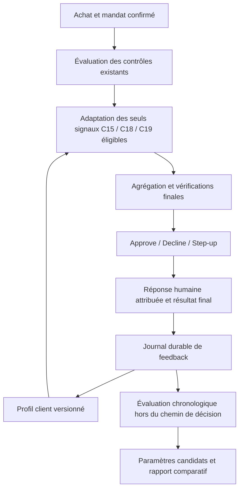

# Plan technique — apprentissage adaptatif par filtre

Date : 19 septembre 2026. Statut mis à jour après implémentation : les profils,
les contrôles durables, le feedback, les paramètres par filtre et la comparaison
sont livrés. La sélection de candidats existe hors ligne sur un corpus synthétique ;
elle n'active pas de nouveaux seuils live. La projection optimisée à grande échelle
et la recette contre l'API hébergée restent à réaliser. Le texte ci-dessous conserve
les objectifs du plan ; la [recette de livraison](18_PROFILS_ADAPTATIFS_LIVRAISON.md)
précise ce qui a été vérifié.

## 1. Résultat recherché et point de départ

Réduire les demandes de confirmation répétitives, pour chaque client et chaque filtre, tout en conservant les contraintes du mandat et une explication reproductible de chaque décision.

Le socle livré est décrit dans [15_APPRENTISSAGE_HABITUDES.md](15_APPRENTISSAGE_HABITUDES.md) : consentement à l'apprentissage, profils distincts par client et environnement, confirmations explicites après approbation finale, déduplication, oubli progressif, persistance et preuves versionnées. C15, C18 et C19 peuvent utiliser ces profils. Les paramètres actuels sont communs : trois dates distinctes, poids cumulé de deux, demi-vie de trente jours, fenêtre de quatre-vingt-dix jours.

Ce socle mémorise des habitudes. Il ne démontre pas encore que ses paramètres sont optimaux et ne mesure pas la précision des alertes supprimées. La suite doit apporter la correction des habitudes, une mesure indépendante, puis une adaptation des paramètres validée par les résultats.

Les sources fonctionnelles sont [challenge.md](../challenge.md), [technical_details.md](../technical_details.md) et les critères du jury fournis par l'utilisateur. Leurs exemples de commandes décrivent le contrat du challenge ; rédiger ce plan n'exécute aucune commande sur l'API.

## 2. Architecture de décision à conserver



Le nombre de `pass` ne compense jamais un échec. Les statuts servent à expliquer la décision et à mesurer la couverture des contrôles, pas à voter sur l'autorisation.

| État d'un contrôle | Effet conservé |
| --- | --- |
| `fail` établi sur une règle contraignante | Refus, même si les autres contrôles passent |
| `needs_review` non résolu | Confirmation humaine nécessaire |
| `not_evaluated` requis à cette phase | Finalisation interdite ; traitement technique existant |
| `not_applicable` justifié | Aucun vote positif ni négatif ; motif conservé |
| `pass` | Ce contrôle est satisfait ; les autres restent indépendants |

L'adaptation peut seulement convertir un signal d'habitude `needs_review` en `pass`, lorsque ses conditions sont réunies. Elle ne transforme pas un fait inconnu en fait vérifié. L'autorisation finale reste soumise à l'atomicité, au budget, à l'état du mandat et aux autres contrôles.

## 3. Un calcul distinct pour chaque filtre

Pour un client `u`, un filtre `i`, un contexte `c` et une date d'achat `t` :

```text
E_i(u,c,t) = somme des 2^(-âge_en_jours / h_i)
            sur les confirmations positives éligibles du contexte,
            une contribution au plus par date locale, dans la fenêtre W_i.

habitude_utilisable = apprentissage_autorisé
                      ET filtre_et_motif_éligibles
                      ET données_du_contexte_disponibles
                      ET aucune_suspension_du_contexte
                      ET jours_distincts >= d_i
                      ET E_i >= T_i
```

`θ_i = (d_i, T_i, h_i, W_i)` est une configuration versionnée par filtre. Initialement, reprendre les valeurs actuelles pour conserver le comportement ; les différencier seulement après validation. `E_i` est un poids de preuves, pas un pourcentage de sécurité ou une probabilité de fraude.

| Filtre | Contexte initial conservé | Ce que sa familiarité ne prouve pas |
| --- | --- | --- |
| C15 — appareil | Identifiant exact de l'appareil | Que cet identifiant est impossible à usurper |
| C18 — horaire | Fuseau, semaine/week-end, tranche de quatre heures | Que l'achat respecte une plage de revue explicitement imposée |
| C19 — pays marchand | Pays exact | Que tous les marchands de ce pays sont fiables ou autorisés |

Un appareil connu ne rend pas un pays connu. Une habitude horaire ne relève pas un plafond. Les preuves sont séparées, mais cela ne suppose aucune indépendance statistique des risques : l'agrégation finale garde tous les contrôles et interactions existants.

## 4. Lot 1 — rendre le feedback exploitable et corrigeable

**Priorité P0. Livrable : journal de feedback typé et commandes de contrôle des habitudes.**

Étendre `packages/contracts/src/behavior.ts` avec des événements immuables : `context_confirmed`, `context_rejected`, `habit_forgotten`, `habit_suspended`, `habit_reenabled`. Conserver une distinction explicite entre réponse humaine, statut final de paiement et effet sur le profil.

Chaque événement porte : client, environnement, filtre, contexte, source stable, autorisation concernée, acteur vérifié, mandat/configuration, version du profil, motif, horodatage simulé, horodatage de réception et numéro de séquence d'enregistrement. Les corrections référencent l'événement corrigé ; les décisions historiques ne sont pas réécrites.

- Une confirmation alimente seulement les faits effectivement présentés et confirmés. Une confirmation groupée peut rester un seul clic si les contextes concernés sont clairement énumérés ; elle ne valide pas les autres filtres implicitement.
- Un refus « appareil inconnu » suspend immédiatement cet appareil dans l'apprentissage. Un refus « trop cher » ne devient pas un exemple négatif pour l'appareil ou le pays.
- Une annulation sans motif, une expiration ou une erreur réseau restent sans label exploitable.
- Une approbation automatique ne crée toujours aucune confirmation positive.
- Un refus de contexte authentifié peut suspendre l'apprentissage même si le résultat réseau est encore inconnu : il s'agit d'une restriction locale. Le résultat du paiement reste affiché selon ce que la plateforme a accepté.
- « Oublier cette habitude » ouvre une nouvelle génération du contexte : les anciennes confirmations ne peuvent pas la recréer au prochain calcul. Une suspension demande une réactivation explicite et de nouvelles preuves ; elle ne disparaît pas par simple passage du temps.
- Une désactivation confirmée arrête collecte et utilisation pour les décisions suivantes couvertes par ce réglage. Définir explicitement sa portée sur une session déjà lancée, sans prétendre modifier le snapshot de mandat hébergé ni annuler un paiement accepté. Une réactivation ne réimporte pas silencieusement les preuves d'une génération oubliée.

Réutiliser SQLite et les journaux existants, avec une migration versionnée. Les anciens enregistrements restent lisibles ; ne pas inventer rétroactivement des labels négatifs ou une confirmation d'habitude.

**Acceptation :** confirmer trois jours, utiliser l'habitude, l'oublier, redémarrer et rejouer les anciennes sources ne la restaure pas ; un refus de montant ne modifie pas C15 ; une réponse d'un autre client est rejetée ; une répétition de commande ne crée qu'un événement.

## 5. Lot 2 — séparer les paramètres et renforcer les preuves

**Priorité P0. Livrable : configuration par filtre et profil reconstructible. Dépend du lot 1.**

Extraire les constantes de `learning/behavior-profile.ts` dans une configuration validée par filtre. Enregistrer séparément `algorithm_version`, `parameter_version`, `profile_version` et la génération de consentement/contexte. Conserver la sélection stricte des motifs dans `learning/learned-habits.ts`.

Utiliser deux conditions pour l'historique : l'achat précédent doit être antérieur selon l'horloge simulée, et son feedback doit déjà être disponible au moment de la décision selon la séquence du journal. Ne jamais comparer directement les horloges réelle et simulée.

La reconstruction doit prendre en compte confirmations, corrections, oubli et suspension. Une panne du calcul facultatif restaure les contrôles ordinaires. Les restrictions explicites de suspension doivent rester vérifiables séparément ; si leur état est indisponible, ne pas autoriser une suppression d'alerte sur la base d'un cache ancien.

**Acceptation :** modifier les paramètres de C18 ne change pas C15/C19 ; un feedback reçu plus tard ne modifie pas une décision historique ; les résultats sont identiques après reconstruction ; un profil d'un autre client, environnement, fuseau ou génération ne s'applique pas. Tester la boucle complète confirmation → apprentissage → application → redémarrage pour chacun des trois filtres, puis les combinaisons : C15 appris avec C19 incertain conserve le step-up, un plafond dépassé conserve le refus et une donnée requise absente empêche la finalisation.

## 6. Lot 3 — mesurer avant d'assouplir davantage

**Priorité P0. Livrable : évaluateur chronologique et rapport par filtre. Peut commencer avec le socle actuel.**

Construire un outil TypeScript dans `apps/offline-runner`, sans nouvel appel IA. À chaque achat, calculer deux évaluations pures sur les mêmes faits et le même état antérieur : moteur de référence sans apprentissage et moteur candidat avec apprentissage. Le candidat observé ne doit écrire aucun engagement, répondre au simulateur ou modifier le budget. Seul le parcours actif produit des effets.

Enregistrer les résultats bruts et adaptés par filtre, la décision finale des deux variantes, les raisons, le profil utilisé et la latence. Distinguer une alerte supprimée d'un achat devenu autonome : si C15 est résolu mais C19 demande toujours une confirmation, le nombre d'interruptions n'a pas diminué.

Pour obtenir des réponses indépendantes du candidat, commencer sur des achats où le moteur de référence demande encore une confirmation. Après activation, les achats devenus automatiques n'ont pas spontanément de label : l'absence de plainte ne vaut pas confirmation. Une phase ultérieure pourra demander une vérification explicite sur un échantillon consenti ; journaliser la sélection et mesurer son coût de friction.

| Mesure | Définition et portée |
| --- | --- |
| Alertes évitées par filtre | Cas `needs_review` de référence transformés en `pass` / cas `needs_review` de référence éligibles |
| Interruptions évitées | Achats où un step-up devient inutile grâce à l'apprentissage, tous contrôles et finalisation pris en compte |
| Suppressions confirmées | Parmi les suppressions disposant d'un retour explicite attribué au filtre, part confirmée par le client |
| Suppressions contredites | Parmi ces mêmes cas vérifiés, nombre et part rejetés pour ce contexte |
| Couverture des retours | Cas de suppression vérifiés / ensemble des cas de suppression ; les cas sans retour restent inconnus |
| Violations des invariants | Autorisations malgré règle bloquante, contrôle requis absent ou confirmation obligatoire : zéro toléré dans la recette |
| Latence et corrections | p50/p95/p99 ajoutés par l'apprentissage ; nombre d'oublis/suspensions et réapparition des alertes |

Toujours afficher numérateurs, dénominateurs et absence de données. Un taux sur les seuls retours disponibles ne devient pas une estimation de toute la population. Séparer également les refus de préférence des incidents de sécurité ; aucun des deux n'est automatiquement une fraude bancaire confirmée.

Créer un corpus synthétique séparé des 45 achats officiels : habitudes légitimes, changement d'appareil, contexte rejeté, dérive horaire, données manquantes, rafale, rejouage, révocation et cumul de signaux. Définir ses labels à partir des intentions du client avant d'exécuter le moteur. Le pack officiel sans labels reste un test de compatibilité et de démonstration, pas une vérité terrain de précision.

Les périodes d'apprentissage, de réglage et d'évaluation finale sont successives. Rejouer les arrivées de feedback dans leur ordre réel de disponibilité ; réserver des trajectoires/scénarios synthétiques indépendants au test final. Le principe de séparation temporelle évite d'apprendre sur le futur ([documentation TimeSeriesSplit](https://scikit-learn.org/stable/modules/generated/sklearn.model_selection.TimeSeriesSplit.html)). Les achats étant irrégulièrement espacés, utiliser des fenêtres calendaires adaptées plutôt qu'appliquer directement ce découpage par indices.

**Acceptation :** un rapport reproductible montre les résultats des trois filtres, les cas non évaluables et les dénominateurs ; aucune mutation du ledger par le candidat ; aucun label futur utilisable ; toute régression de sécurité introduite volontairement fait échouer la recette.

## 7. Lot 4 — adapter les paramètres à partir des résultats

**Priorité P1. Livrable : candidats versionnés et sélection évaluée. Dépend des lots 1 à 3.**

Deux adaptations différentes sont nécessaires :

1. **Habitudes du client :** mise à jour automatique après feedback admissible, avec oubli et suspension. C'est la boucle rapide, déjà amorcée dans le socle.
2. **Paramètres de chaque filtre :** comparaison hors du chemin de décision d'un petit ensemble de configurations, sur des données étiquetées suffisantes. C'est la boucle lente à construire.

Au début, garder les paramètres par filtre communs aux clients, mais les profils individuels. Un petit nombre de réponses personnelles ne suffit pas à régler quatre paramètres pour chaque client. Ne pas partager les historiques personnels entre clients pour rendre un contexte familier.

Pour le prototype, comparer quelques candidats préenregistrés autour des valeurs actuelles. Minimiser les confirmations inutiles observées sous contraintes : aucune violation des règles fixes, aucune suppression contredite sur le corpus synthétique réservé et latence conforme. Ne pas choisir un candidat avec le nombre brut d'approbations ou avec les données ayant servi à sa validation finale. La séparation entre réglage et évaluation limite le surapprentissage ([documentation sur les seuils](https://scikit-learn.org/stable/modules/classification_threshold.html)).

Un rapport sans retours suffisants ou sans exemples négatifs reste « données insuffisantes » ; il ne déclenche aucun assouplissement. Les seuils d'effectifs et le risque acceptable pour un déploiement réel dépendent d'une validation bancaire hors du périmètre de ce prototype. Le zéro échec d'une recette synthétique n'est pas une garantie statistique de risque nul.

Chaque candidat passe de `candidate` à `shadow`, puis `validated` avant une éventuelle activation. La validation automatique en démonstration s'appuie sur le corpus isolé ; en live, garder la version active tant que les preuves ne suffisent pas. Une activation change une référence de version atomiquement, conserve la version précédente et journalise son rapport. Une correction client suspend immédiatement le contexte concerné ; une régression d'invariant invalide la version et restaure le comportement de référence.

Ne pas ajouter à ce stade une « probabilité de fraude » ni un modèle complexe. Si un modèle probabiliste est introduit plus tard, il devra être calibré et vérifié sur des labels appropriés ; un poids de confirmations ne possède pas cette interprétation ([documentation sur la calibration](https://scikit-learn.org/stable/modules/calibration.html)).

**Acceptation :** un mauvais candidat est rejeté automatiquement ; un candidat sans données reste en observation ; une ancienne version est restaurable ; chaque décision explique quelle version et quelles observations ont justifié l'adaptation.

## 8. Lot 5 — maîtriser le coût et valider l'API

**Priorité P1, après mesure du lot 3. Livrable : projection incrémentale si nécessaire et recette live.**

Le code actuel relit les décisions pour reconstruire les profils. Mesurer d'abord ce coût. Si sa croissance dépasse le budget, matérialiser une projection SQLite par client/environnement/filtre/contexte, avec un curseur du journal. Elle reste reconstruisible ; traiter une correction, une révocation et une activation de version atomiquement.

Le worker utilise une version cohérente et disponible avant l'évaluation. Aucun entraînement, recherche de paramètres ou appel distant supplémentaire n'est ajouté au chemin de décision. Un cache périmé ne peut pas faire revivre une habitude suspendue.

Budget d'ingénierie proposé, à mesurer : surcoût d'apprentissage p95 inférieur à 10 ms et p99 inférieur à 25 ms sur un jeu de 100 000 événements et le matériel de démonstration documenté. Ces valeurs sont des cibles, pas des performances déjà obtenues. La contrainte décisive reste `deadline_at` ; le délai par défaut de huit secondes inclut la file et le réseau, et les valeurs effectives viennent de `/v1/bootstrap`.

Recette hébergée : confirmation via `/resolve`, acceptation distante effective avant apprentissage positif, retry sans doublon, timeout sans label positif, redémarrage, réponses différées et révocation. Le délai humain et les deux horloges restent distincts. Aucun appel live n'est nécessaire pour rédiger ou vérifier ce plan.

**Acceptation :** projection et reconstruction complète produisent le même profil ; une panne ne masque pas une restriction ; aucun double engagement ; budget mesuré et respect des échéances du simulateur.

## 9. Ordre de livraison et démonstration

| Ordre | Changement | Preuve attendue |
| --- | --- | --- |
| 1 | Feedback attribué, oubli et suspension | Le client peut corriger une habitude durablement |
| 2 | Paramètres et versions distincts par filtre | Une modification de C18 n'assouplit pas C15/C19 |
| 3 | Comparaison chronologique et rapport | Gain mesuré, contradictions et inconnus visibles |
| 4 | Sélection de candidats | Une proposition qui dégrade la sécurité n'est pas activée |
| 5 | Optimisation mesurée et recette live | Délai respecté, résultat API et feedback cohérents |

Pour une démonstration de hackathon, terminer les trois premiers lots avant d'étendre à d'autres filtres. Montrer le lot 4 sur un corpus synthétique explicitement annoncé si le temps le permet. Le lot 5 devient prioritaire dès qu'un problème de latence ou de raccordement est observé.

Démonstration : confirmer un appareil à trois dates distinctes, montrer la disparition de son alerte à l'achat suivant, introduire un dépassement de plafond qui reste refusé, oublier l'appareil, constater le retour de la confirmation, puis afficher le rapport comparatif et les preuves. Si un autre filtre impose un step-up, l'afficher : « appareil reconnu » ne signifie pas « achat autorisé ».

Le corpus officiel reste inchangé ; les dates supplémentaires appartiennent au corpus synthétique séparé. Un replay de source ne doit jamais servir à fabriquer de la confiance. Les tests actuels d'apprentissage, persistance et interface restent la base de non-régression ; chaque lot ajoute les tests de comportement indiqués et se termine par typecheck, tests appropriés et build.

## 10. Correspondance avec les critères du jury

| Critère | Preuve apportée par ce plan |
| --- | --- |
| User Centricity — 25 % | Moins d'interruptions répétées, correction et oubli compréhensibles |
| Security & Transparency — 25 % | Règles fixes préservées, provenance du feedback, audit et retour arrière |
| Innovation — 20 % | Adaptation distincte par filtre, oubli temporel, correction et comparaison automatique de candidats |
| Feasibility — 15 % | Extension TypeScript/SQLite du moteur existant, recette locale et API, budget de latence |
| Viability — 15 % | Interruptions évitées et coût par décision mesurables, intégration backend/UI conservée |

La valeur à défendre est vérifiable : le moteur réutilise des confirmations explicites, accepte les corrections et peut démontrer quand une évolution améliore ses décisions. L'amélioration générale de précision dépend de la qualité et de la couverture des retours, pas du seul nombre d'utilisations.
